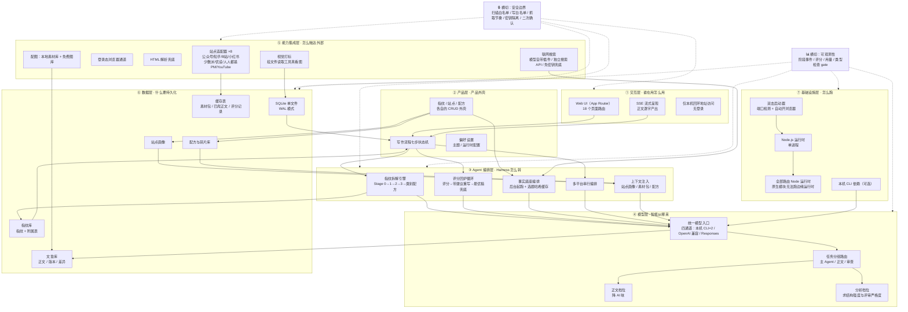
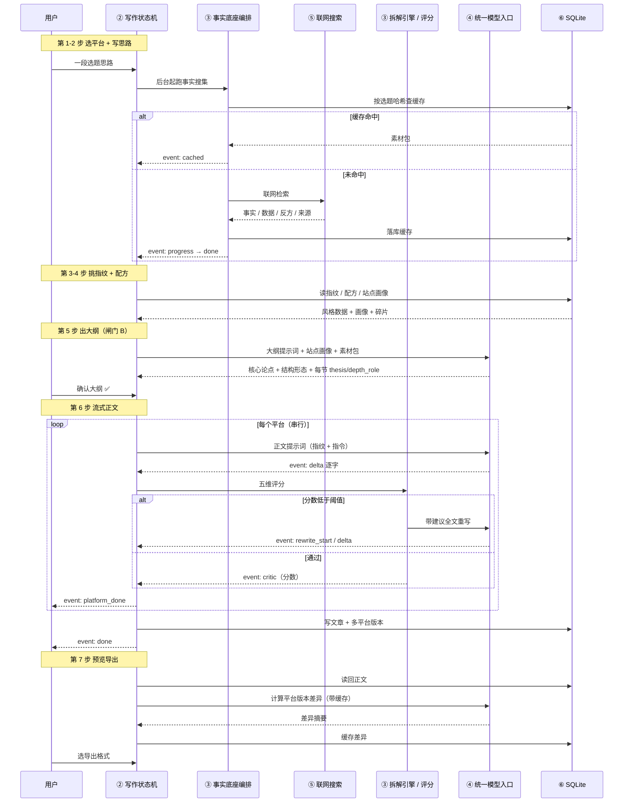

# 笔迹 ByTrace · 架构设计

> 版本：v1.0 · 更新：2026-05-24
> 范围：七层架构、Harness 组件选型、数据流、安全边界、可观测性
> 关联文档：需求见 `PRD.md`，接口见 `API.md`，数据结构见 `DATA-MODEL.md`，选型理由见 `TECH-STACK.md`

---

## 一、核心恒等式

```
Agent = 模型（智能，已训练好） + Harness（载具，我们构建的代码）
```

笔迹 ByTrace 的 Harness 五要素：

| 要素 | 在本产品里是什么 |
| --- | --- |
| **工具 Tools** | 多站点抓取（HTML 解析 / 无头浏览器通道）、素材库扫描与视觉打标、联网事实搜索、**风格指纹拆解引擎**（最核心的领域工具） |
| **知识 Knowledge** | 写作规则常量、写作方法论资产、种子语料库、平台口味元数据 |
| **观察 Observation** | 五维评分、跨模型审查、SSE 实时进度事件、平台版本差异摘要 |
| **行动 Action** | SSE 流式产出正文、四种导出格式、数据落库、页面状态同步 |
| **权限 Permissions** | 素材扫描白名单、设置写入白名单、抓取节奏红线、破坏性操作二次确认、密钥隔离 |

**一句话**：模型是驾驶者，**风格指纹 + 论证骨架是这款载具的专属底盘**。

---

## 二、七层架构



### 逐层落地锚点

| 层 | 名称 | 落地锚点 | 层内约束 |
| --- | --- | --- | --- |
| ① | 交互层 | `app/**/page.tsx`（18 个路由）、`components/**/*.tsx` | 一个 `page.tsx` = 一个 URL；页面组件不写网络请求逻辑，抽成 Hook |
| ② | 产品层 | 写作流程状态机、`app/fingerprints/`、`app/sites/`、`app/recipes/` | 流程状态显式建模，可回退、可中止 |
| ③ | Agent 编排层 | 指纹拆解引擎、评分回炉编排、站点画像引擎、事实底座编排 | 编排逻辑集中在引擎模块，路由只做校验 + 落库 + 推事件 |
| ④ | 模型层 | `lib/claude.ts`（统一模型入口） | 流式必须走结构化流式协议，否则会长时间静默无输出 |
| ⑤ | 能力集成层 | `lib/crawler/`、`lib/search/`、`lib/images/` | 每个站点适配器实现同一接口（匹配 / 抓单篇 / 抓列表 / URL 类型判定） |
| ⑥ | 数据层 | `lib/db.ts`、`lib/schema*.sql`、`lib/schema-additions-*.ts` | **加字段必须走幂等扩列函数**，不直接改基础建表脚本 |
| ⑦ | 基础设施层 | `next.config.ts`、启动器、环境配置 | 所有路由固定 Node 运行时 |

---

## 三、贯穿各层的数据流（一次完整写作）



**读这条链路能看出的四个架构特征**：

1. **两处异步解耦**：事实底座后台起跑（不阻塞主流程）；配图在第 7 步自动起跑。
2. **一处强制同步闸门**：第 5 → 6 步必须人工确认大纲。
3. **一处刻意串行**：多平台生成串行，避免订阅制通道并发限速。
4. **三层缓存**：素材包按选题哈希、版本差异按内容哈希、已抓正文按 URL 哈希。

---

## 四、Harness 组件选型

**选型原则：只选需要的，不为完整而选。** 下表记录每个候选组件的取舍结论与理由。

| 组件 | 选了吗 | 落地锚点 / 取舍理由 |
| --- | --- | --- |
| **Agent Loop** | ⚠️ 以固定编排替代 | 本产品是**固定编排**而非自由循环：拆解是显式多阶段流水线，评分是显式打分重写循环。**故意不做通用循环**——写作任务路径确定，自由循环只会让成本和结果不可控 |
| **工具系统** | ✅ 选了 | 统一的站点适配器注册表 + 一致接口；素材与图像工具集 |
| **权限系统** | ⚠️ 部分选了 | 有：素材扫描白名单、设置写入白名单、抓取节奏红线、破坏性操作二次确认。**没有**：通用工具审批管道与审计日志（单用户本机场景收益低） |
| **钩子系统** | ❌ 没选 | 没有需要拦截或埋点的工具调用场景，不引入额外抽象 |
| **任务规划** | ⚠️ 以产品形态实现 | 七步流程就是「先计划后执行」的产品化版本，**大纲本身就是持久化的计划** |
| **子 Agent** | ✅ 选了 | 指纹拆解阶段对多篇文章并行处理，上下文互相隔离，省 token |
| **技能加载** | ✅ 选了 | 写作方法论资产「目录先行 + 正文惰性加载」；核心规则以摘要版常量注入，避免上下文过重 |
| **上下文压缩** | ❌ 没选 | 每次调用是独立提示词，不累积长会话，不需要压缩层 |
| **记忆系统** | ✅ 以领域形态选了 | 风格指纹 / 站点画像 / 风格配方 / 种子语料库，就是本产品的「记忆」。但**不是通用记忆系统**——没有筛选→提取→整合三子系统，是显式的结构化记忆 |
| **任务系统** | ❌ 没选 | 无依赖图、无原子状态变更需求；流程状态在前端与数据库 |
| **后台任务** | ✅ 选了 | 事实底座后台起跑；配图自动起跑；长任务路由声明更长执行上限 |
| **定时调度** | ❌ **明确没选（红线）** | 抓取红线第一条就是「禁止定时高频轮询」。**主动放弃**该能力 |
| **Agent 团队** | ❌ 没选 | 单用户单进程，无并行隔离工作区需求 |
| **MCP 插件** | ❌ 没选 | 外部能力走**直接集成的适配器**，不走 MCP。单机项目引入 MCP 只增加故障面 |
| **集成 Harness** | ⚠️ 部分 | 没有动态重建系统提示词；提示词按阶段分别组装 |
| **工作流运行时** | ❌ 没选 | 编排是代码内固定的（评分回炉循环），没有脚本级编排需求 |
| **目标闭环** | ✅ **用评分回炉实现了** | 独立判断器审查「是否达标」：五维评分 → 不达标不停止 → 带建议重写 → 最优稿兜底，且 **fail-open**（评分器故障不阻塞交付） |

**覆盖率总结**：明确选用 6 项、以领域形态部分实现 4 项、明确不选 7 项。

> **这个覆盖率本身就是架构决策**：笔迹 ByTrace 是**领域专用载具**，不是通用 Agent 平台。它把「通用 Agent 该有的机制」替换成了「写作领域该有的机制」——风格指纹、论证骨架、五维评分、抓取节奏。

---

## 五、提示词与认知层

### 5.1 三层结构

```
lib/prompts/
├── writing-rules.ts        ← 共享写作规则常量（摘要版）
│     大纲规则 / 成文规则 / 评审规则
├── <任务>/*.ts              ← 各任务的提示词组装
│     大纲 / 正文 / 评分 / 润色 / 版本差异
│     指纹 Stage0 / Stage1 / Stage2 / 类别配方 / 跨平台
│     站点画像 / 选题推荐 / 热点聚合 / 图像关键词
└──（调用处注入）             ← 站点画像 / 素材包 / 配方碎片 / 指纹 JSON
```

### 5.2 认知层的三个注入块

| 注入块 | 来源 | 作用 | 缺失时的行为 |
| --- | --- | --- | --- |
| **站点画像块** | 站点画像表 | 注入板块偏好的结构 / 深度 / 类比密度 | 提示词自动降级 |
| **事实底座块** | 素材包缓存 | 提供真实数字与来源。**有素材包时强约束**：所有具体数字、人名、事件、引用必须来自素材包，禁止编造；没有则用定性描述 | 自动降级，等同于不启用 |
| **风格指纹块** | 指纹表 | 注入多维风格特征 + 结构能力库 + 挖根模式 + 物件类比库 | 走通用风格 |

### 5.3 三条硬规则（所有写作提示词的公共底线）

1. **大纲**：结构由论证决定（因果链 / 问题到机制 / 实验过程 / 任务拆解 / 对照推理），**禁止默认三段式和纯平行罗列**；证据不足时**降级主张**，不用强语气填洞。
2. **成文**：第一人称只承担真实亲历、判断与选择责任，不能编造动作、情绪、对白、动机、现场细节；删除 AI 痕迹（报幕式过渡 / 段尾升华 / 万能暖场 / 空泛形容词 / 过量比喻）。
3. **评审**：检查洞察是否解释真实矛盾（而非把共识换说法）、主张与证据与机制与边界是否对应、是否有 AI 腔、推荐实测类是否有真实任务与失败范围。

---

## 六、上下文与记忆策略

| 问题 | 方案 |
| --- | --- |
| 会话内怎么管 | 前端框架状态（流程步骤 / 各平台草稿 / 润色结果）+ 轻量全局状态只放主题与提示 |
| 跨会话怎么持久化 | 全部落单文件数据库。**没有「会话」概念**——每次写作是一条独立的文章记录 |
| 什么算长期记忆 | 风格指纹（学过的博主）、站点画像（学过的平台）、风格配方（拼合偏好）、种子语料库（自己的旧文） |
| 怎么检索记忆 | 按 id 精确取；按类别 / 标签 / 平台检索碎片 |
| 冲突怎么办 | 用户当次输入优先于配方文本 |
| 缓存怎么省 | 素材包按选题哈希幂等；版本差异按内容哈希失效；已抓正文按 URL 哈希去重 |

---

## 七、权限与安全边界

| 边界 | 实现 | 失败行为 |
| --- | --- | --- |
| 文件扫描范围 | 白名单根目录 | 返回 403 + 可读说明 |
| 设置写入 | key 白名单 + 取值校验 | 返回 400，明确提示哪个 key 不允许 |
| 素材文件读取 | 校验记录存在 + 文件在磁盘 | 400 / 404 / 410 三档 |
| 抓取节奏 | 适配器层强制间隔，按平台分档 | 代码级，不可绕过 |
| 抓取批量上限 | 单次拆解 ≤ 20 篇 | 产品级约束 |
| 破坏性操作 | 删除类两段式确认 | 界面层拦截 |
| 密钥 | 只落本地环境文件；不进代码、不进前端产物、不进版本库 | — |
| 错误信息 | 统一错误结构，**不泄露堆栈** | — |
| 服务暴露 | 仅绑定本机回环地址 | — |

**当前不做的**：登录鉴权、通用工具审批管道、审计日志。理由是「本机回环 + 单用户」已构成物理隔离。**约束**：一旦部署形态变化（绑定外网或多人使用），该假设失效，必须补齐鉴权。

---

## 八、可观测性设计

| 观测点 | 实现 |
| --- | --- |
| 阶段进度 | SSE 阶段事件（拆解分阶段 / 事实搜集进度 / 多平台开始） |
| 模型输出 | SSE 增量事件（逐字产出） |
| 质量评分 | 评分事件 + 评分记录表（五维明细 + 理由） |
| 重写轨迹 | 重写开始 / 最优稿兜底 / 评分失败事件 |
| 抓取通道 | 通道与失败原因回报 |
| 类型安全 | `tsc --noEmit` 作为提交前 gate |
| 运行自检 | `GET /api/health` 报告各任务组配置状态；`GET /api/health/search` 实测联网通道连通性 |
| 缓存命中 | 缓存命中事件 |

**当前不做的**：结构化日志聚合、指标上报、跨调用 trace id、成本累计。后续按需补。

---

## 九、部署形态

| 项 | 结论 |
| --- | --- |
| 进程模型 | 单进程 Node 服务 |
| 部署形态 | 本机回环地址起服务，浏览器访问 |
| 数据 | 单文件 SQLite（WAL 模式） |
| 外部依赖 | 可选的本机 CLI；Node.js；SQLite 由驱动内置 |
| 云组件 | 无数据库服务、无对象存储、无消息队列、无容器 |
| 可移植性要求 | **不允许硬编码任何机器路径**；CLI 位置按用户主目录推导 + 环境变量覆盖 |

---

## 十、当前架构约束与后续演进

以下是为保持交付节奏而**有意接受**的限制，按影响排序记录，供后续迭代参考。

| # | 约束 | 影响 | 演进方向 |
| --- | --- | --- | --- |
| 1 | 写作流程页组件过大 | 单文件承载了流程状态机与多平台编排，维护成本高 | 抽 `useSseStream` 等 Hook，把网络与状态逻辑下沉到 L3 层 |
| 2 | 指纹拆解逻辑在新增与重提炼两条路径间存在重复 | 修改一处容易漏另一处 | 统一收敛到同一个拆解引擎 |
| 3 | 风格配方引用碎片 id，重提炼会换新 id | 配方可能静默失效 | 让碎片 id 稳定化，或在重提炼时回填 |
| 4 | 多平台中止后只能整批重跑 | 浪费额度 | 支持按平台局部重试 |
| 5 | 无自动化测试套件 | 回归依赖类型检查与手工验证 | 先补关键路径（脱围栏解析、版本归一、评分解析）单测 |
| 6 | 无成本护栏 | 高频使用可能超出预期开销 | 加会话级累计计数器与单次上限 |
| 7 | 长任务无断点续跑 | 中途失败需整体重来 | 阶段级结果落库，支持续跑 |
| 8 | 桌面化尚未完成 | 需手动起服务 | 套壳为原生应用，内含启动器与版本守卫 |
