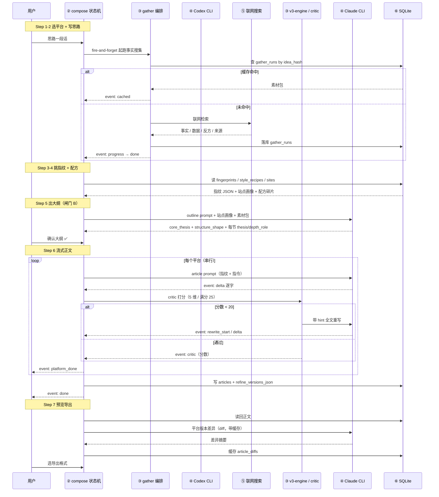

# 笔迹 ByTrace · 架构文档

> **方法来源**：本文的分层框架取自 `agent-blueprint-main` 的《Agent 产品架构蓝图》——七层架构 + Harness 五要素 + 组件选型映射表。
> **事实来源**：所有层的内容都是从实际源码提取的，不是设计愿景。每节标注了落地锚点。
> 对应代码状态：`main` @ `90faee7` · 最后更新：2026-09-24

---

## 一、核心恒等式

```
Agent = 模型（智能，已训练好） + Harness（载具，本项目写的代码）
```

拆到 Harness 五要素，笔迹 ByTrace 的对应关系：

| 要素 | 在这个项目里是什么 |
| --- | --- |
| **工具 Tools** | 多站点爬虫（cheerio / Readability / OpenCLI / Apify）、配图扫描与视觉打标、联网事实搜索（Tavily / Google CSE / DuckDuckGo / MiMo）、**风格指纹拆解引擎**（最核心的领域工具） |
| **知识 Knowledge** | 写作规则常量（`lib/prompts/xiaopu-writing.ts`）、方法论资产目录（`data/xiaopu-skill/`）、种子语料库（`data/xiaopu-article-kb/` 22 篇）、平台口味元数据（`lib/platforms.ts`） |
| **观察 Observation** | critic 五维打分、codex 跨模型审查、SSE 实时进度事件、`article_diffs` 平台版本差异、grep/tsc 自检 |
| **行动 Action** | SSE 流式产出正文、4 种导出格式、SQLite 落库、`router.refresh()` 页面同步 |
| **权限 Permissions** | 素材扫描白名单（越界 403）、settings 写入白名单、反爬节奏红线、破坏性操作两段式确认、密钥不进仓库 |

**一句话**：模型是驾驶者，**风格指纹 + 论证骨架是这款载具的专属底盘**。

---

## 二、七层架构

```mermaid
flowchart TB
    subgraph L1["① 交互层 · 谁在用怎么用"]
        A1["Web UI (Next App Router)<br/>18 个页面路由"]
        A2["SSE 流式呈现<br/>用户盯着字出来"]
        A3["127.0.0.1 本机访问<br/>无登录"]
    end

    subgraph L2["② 产品层 · 产品外壳"]
        B1["compose 7 步状态机<br/>app/compose/page.tsx"]
        B2["fingerprints / sites / recipes<br/>各自的 CRUD 外壳"]
        B3["settings 偏好<br/>主题 / token"]
    end

    subgraph L3["③ Agent 编排层 · Harness 怎么转"]
        C1["指纹拆解引擎 v3-engine<br/>Stage0→1→2→3→category"]
        C2["critic reflection loop<br/>打分→带 hint 重写→best-of-N"]
        C3["gather 事实底座<br/>fire-and-forget + idea_hash 幂等"]
        C4["多平台串行编排<br/>platforms[] 循环"]
        C5["上下文注入<br/>站点画像 / 素材包 / 配方"]
    end

    subgraph L4["④ 模型层 · 智能从哪来"]
        D1["streamClaude<br/>本机 Claude CLI 订阅"]
        D2["codex-cli provider<br/>lib/claude.ts 内的分支"]
        D3["ARTICLE_MODEL = Sonnet<br/>降 AI 味"]
        D4["分析类走 CLI 默认档<br/>要结构与评审强度"]
    end

    subgraph L5["⑤ 能力集成层 · 怎么触达外部"]
        E1["爬虫适配器 × 8<br/>公众号/知乎/B站/小红书<br/>少数派/优设/人人都是PM/YouTube"]
        E2["OpenCLI 借登录浏览器"]
        E3["cheerio 兜底<br/>纯本地解析"]
        E4["联网搜索<br/>Tavily/GoogleCSE/DDG/MiMo"]
        E5["配图：本地素材库 + Unsplash"]
        E6["Claude 视觉打标<br/>挂 Read 工具真看图"]
    end

    subgraph L6["⑥ 数据层 · 什么要持久化"]
        F1["SQLite data/autoarticle.db<br/>WAL 模式 · 单机文件"]
        F2["指纹库 5 表<br/>fingerprints + 附属"]
        F3["文章库<br/>articles / article_images / article_diffs"]
        F4["站点画像 sites / site_articles"]
        F5["配方 style_recipes<br/>碎片库 strategy_fragments_indexed"]
        F6["缓存表<br/>gather_runs / crawled_articles / critic_runs"]
    end

    subgraph L7["⑦ 基础设施层 · 怎么跑"]
        G1["Node.js 运行时<br/>单进程"]
        G2["全部 route runtime=nodejs<br/>原生模块跑不了 edge"]
        G3["双击启动器<br/>端口检测 + 自动开浏览器"]
        G4["本机 CLI 依赖<br/>claude / codex / opencli"]
    end

    A1 --> B1
    A2 --> B1
    B1 --> C1
    B1 --> C2
    B1 --> C5
    B2 --> C3
    B1 --> C4
    C1 --> D1
    C2 --> D1
    C3 --> D1
    C3 --> E4
    C4 --> D1
    C5 --> D1
    C5 --> D1
    D1 --> F3
    D2 --> F6
    E1 --> F6
    E4 --> C3
    E5 --> F3
    E6 --> F1
    C1 --> F2
    B2 --> F4
    B2 --> F5
    F1 --> B1
    F2 --> B1
    F4 --> C6
    F5 --> C6
    G1 --> G2
    G3 --> G1
    G4 --> D1
    G4 --> D2

    SEC["🔒 横切：安全边界<br/>扫描白名单 / 写白名单 / 反爬节奏 / 密钥隔离 / 两段式确认"]
    OBS["📊 横切：可观测性<br/>SSE 阶段事件 / critic 评分 / Apify 用量 pill / tsc gate"]
    SEC -.-> L1
    SEC -.-> L3
    SEC -.-> L5
    SEC -.-> L6
    OBS -.-> L3
    OBS -.-> L4
    OBS -.-> L6
    OBS -.-> L7
```



### 逐层落地锚点

| 层 | 名称 | 落地锚点（真实文件） | 这一层的硬约束 |
| --- | --- | --- | --- |
| ① | 交互层 | `app/**/page.tsx`（18 个路由）、`components/**/*.tsx` | 一个 `page.tsx` = 一个 URL；Page 不写 fetch 逻辑，要抽 Hook |
| ② | 产品层 | `app/compose/page.tsx`（7 步状态机）、`app/fingerprints/`、`app/sites/`、`app/recipes/` | **已知违反**：compose page **3512 行**，超出自家的 L1–L5 分层规则 |
| ③ | Agent 编排层 | `lib/fingerprints/v3-engine.ts`、`lib/critic.ts`、`lib/sites/profile-engine.ts`、`app/api/compose/gather` 的编排 | 引擎不在 route 里拼；route 只做校验 + 落库 + SSE |
| ④ | 模型层 | `lib/claude.ts`（`streamClaude`，含 `claude-cli` / `codex-cli` / `openai-compatible` / `openai-responses` 四 provider） | 流式必须 `--output-format stream-json`，裸 `claude -p` 会静默 100+ 秒 |
| ⑤ | 能力集成层 | `lib/crawler/`（8 个 adapter）、`lib/search/`、`lib/images/` | 每个 adapter 实现 `SiteAdapter` 接口（matches / crawlArticle / crawlAuthorIndex / urlKind） |
| ⑥ | 数据层 | `lib/db.ts`（单例 + 幂等扩列）、`lib/schema*.sql`、`lib/schema-additions-*.ts` | **加字段必须走幂等 `ensureXxx()`**，不改 `schema.sql` 顶层 |
| ⑦ | 基础设施层 | `next.config.ts`、启动器脚本、`.env.local` | 每个 route 必须 `export const runtime = 'nodejs'` |

---

## 三、贯穿各层的数据流（一次完整写作）



**读这条链路能看出的架构特征**：
1. **两处异步解耦**：gather 事实底座是 fire-and-forget（不阻塞主流程）；配图是 Step 7 自动起跑。
2. **一处强制同步闸门**：Step 5→6 必须人工确认大纲。
3. **一处刻意串行**：多平台生成串行，因为本机 CLI 是订阅制，并发会撞限速。
4. **三层缓存**：`gather_runs`（按 idea_hash）、`article_diffs`（按 article_id+from+to+hash）、`crawled_articles`（按 url_hash）。

---

## 四、Harness 组件选型（对照 agent-blueprint 的 17 组件映射表）

**选型原则：只选需要的，不为完整而选。** 下表把 agent-blueprint 的 17 个生产级组件逐一对照本项目的实际取舍——**选了哪个、在代码哪、为什么不选**。

| 组件 | 选了吗 | 落地锚点 / 不选的理由 |
| --- | --- | --- |
| **s01 Agent Loop** | ✅ **选了，但没有通用 loop** | 本项目是**固定编排**而非自由 loop：`v3-engine` 是显式 Stage 0→1→2→3 流水线，`critic` 是显式打分重写循环。**故意不做通用 loop**——写作任务路径确定，自由 loop 只会让成本和结果不可控 |
| **s02 工具系统** | ✅ 选了 | `lib/crawler/index.ts` 的 `SPECIFIC_ADAPTERS` 注册表 + 统一 `SiteAdapter` 接口；`lib/images/` 的工具集 |
| **s03 权限系统** | ⚠️ 部分选了 | 有：素材扫描白名单（403）、settings 写白名单（**当前仅允许 `default_theme`**）、反爬节奏红线、破坏性操作两段式确认。**没有**：工具审批管道 / 审计日志（单用户本机，收益低） |
| **s04 钩子系统** | ❌ 没选 | 没有工具生命周期扩展点。理由：没有需要拦截/埋点的工具调用场景 |
| **s05 任务规划** | ⚠️ 以产品形态实现 | compose 的 7 步 Stepper 就是"先计划后执行"的产品化版本，**大纲就是持久化的计划**（落 `articles`） |
| **s06 子 Agent** | ✅ 选了 | 指纹拆解 Stage 1 **多 agent 并行**（`app/api/fingerprint/v3/route.ts` 并发跑多篇 stage1）。上下文隔离是为了省 token |
| **s07 技能加载** | ✅ 选了 | `data/xiaopu-skill/SKILL.md`（目录先行）+ 8 个 `references/*.md` 惰性加载；`lib/prompts/xiaopu-writing.ts` 是摘要版注入（**摘要版存在的原因就是避免上下文过重**，代码注释明说） |
| **s08 上下文压缩** | ❌ 没选 | 每次调用是独立 prompt，不累积长会话，所以不需要压缩层 |
| **s09 记忆系统** | ✅ **以领域形态选了** | 风格指纹（5 张表）+ 站点画像 + 风格配方 + 语料库，就是本项目的"记忆"。但**不是通用记忆系统**：没有筛选→提取→整合三子系统，是显式的结构化记忆 |
| **s10 任务系统** | ❌ 没选 | 无依赖图 / 无原子状态变更。compose 状态在前端内存 + DB 落库 |
| **s11 后台任务** | ✅ 选了 | gather 事实底座 fire-and-forget；配图 Step 7 自动起跑；`maxDuration = 300` |
| **s12 定时调度** | ❌ **明确没选（红线）** | 反爬红线第一条就是"禁止定时高频 polling"。**主动放弃**这个能力 |
| **s13 Agent 团队** | ❌ 没选 | 单用户单进程，无并行隔离工作区需求 |
| **s14 MCP 插件** | ❌ 没选 | 外部能力（爬虫/搜索/配图）走**直接集成的 adapter**，不走 MCP。理由：单机项目引入 MCP 只增加故障面 |
| **s15 集成 Harness** | ⚠️ 部分 | 没有动态重建系统提示词；prompt 是按阶段分别拼装的（`lib/prompts/*`）。**关键超时（改代码前必看）**：`streamClaude` 默认 **180s**；指纹 stage2 **480s**、stage3 / category **360s**；**draft 每平台 480s**（`PER_PLATFORM_TIMEOUT_MS`，`app/api/compose/draft/route.ts:70`）；outline **240s**（`app/api/compose/outline/route.ts:132`）；`tag-assets` `maxDuration` **300s** |
| **s16 工作流运行时** | ❌ **曾实现，现已删除** | 原来有一个硬编码的跨模型工作流 `lib/research.ts` 的 `runResearchLoop()`（collect → draft → review → revise ≤2 → best-of-N），**但该文件连同 `/research` 整条链路已从工作树删除**。现在项目里最接近"工作流"的是 critic reflection loop（`lib/critic.ts`）——它由 `lib/claude.ts` 直接驱动，**没有脚本级编排能力**（Next app 内也跑不了 workflow） |
| **s17 目标闭环** | ✅ **用 critic 实现了** | `lib/critic.ts` 就是"独立判断器审查停止"：critic 打分 → 不达标不停止 → 带 hint 重写 → best-of-N 兜底。**fail-open**（critic 挂了不阻塞） |

**覆盖率总结**：17 个组件里明确选了 6 个（s02 / s06 / s07 / s09 / s11 / s17）、以领域形态部分实现 3 个（s03 / s05 / s15）、明确不选 7 个（s04 / s08 / s10 / s12 / s13 / s14，以及 s01 的通用 loop）、**1 个曾实现但已删除**（s16）。

> **这个覆盖率本身就是架构决策**：笔迹 ByTrace 是**领域专用载具**，不是通用 Agent 平台。它把"通用 Agent 该有的机制"替换成了"写作领域该有的机制"（风格指纹 / 论证骨架 / critic 评分 / 反爬节奏）。

---

## 五、系统提示词与认知层

### 5.1 prompt 三层结构

```
lib/prompts/
├── xiaopu-writing.ts      ← 共享写作规则常量（摘要版）
│      XIAOPU_OUTLINE_RULES / XIAOPU_ARTICLE_RULES / XIAOPU_CRITIC_RULES
├── <任务>/*.ts            ← 各任务的具体 prompt 组装
│      outline.ts / article.ts / critic.ts / refine.ts / diff.ts
│      fingerprint-v3-stage0.ts / stage1.ts / stage2.ts / category.ts / cross-platform.ts
│      siteprofile.ts / topic-recommend.ts / topic-trending.ts / image-keywords.ts / research.ts
└── (被调用处注入)          ← 站点画像 / 素材包 / 配方碎片 / 指纹 JSON
```

### 5.2 认知层的三个注入块

| 注入块 | 来源 | 作用 | 空的时候 |
| --- | --- | --- | --- |
| **站点画像块** | `sites` 表（`target_site_id`） | 注入板块的 `preferred_structures` / `preferred_depth` / `analogy_density` | prompt 自动降级 |
| **事实底座块** | `gather_runs`（`research_material`） | 提供真实数字/来源。**有素材包时强约束**：所有具体数字/人名/事件/引用必须来自素材包，禁止编造，没有就用定性描述 | prompt 自动降级，等同改造前 |
| **风格指纹块** | `fingerprints` 表 | 注入 12 维度 + `structure_repertoire` / `depth_pattern` / `analogy_bank` | 走通用风格 |

### 5.3 系统提示词草案（从代码反推的真实内容）

**身份**：`"你是 AutoArticle 的纯文本写作/分析模型。只完成用户给出的写作、改写、JSON 生成或评分任务。"`（`lib/claude.ts:493`，本轮将改名为 笔迹 ByTrace）

**三条硬规则**（来自 `xiaopu-writing.ts`，是所有写作 prompt 的公共底线）：

1. **大纲**：结构由论证决定（因果链/问题到机制/实验过程/任务拆解/对照推理），**禁止默认三段式和纯平行罗列**；证据不足时**降级主张**，不用强语气填洞。
2. **成文**：第一人称只能承担真实亲历/判断/选择责任，不能编造动作、情绪、对白、动机、现场细节；删除 AI 痕迹（报幕式过渡 / 段尾升华 / 万能暖场 / 空泛形容词 / 过量比喻）。
3. **评审**：检查洞察是否解释真实矛盾（而非把共识换说法）、主张/证据/机制/边界是否对应、是否有 AI 腔、推荐实测类是否有真实任务与失败范围。

---

## 六、上下文与记忆策略

| 问题 | 本项目的答案 |
| --- | --- |
| 会话内怎么管 | 前端 React state（`draftMap` / `refineMap` / `step`）+ Zustand 只放主题。**不引入 TanStack Query**（项目规则） |
| 跨会话怎么持久化 | 全部落 SQLite。**没有"会话"概念**——每次写作是一条独立的 article 记录 |
| 什么算长期记忆 | 风格指纹（学过的博主）、站点画像（学过的平台）、风格配方（拼合偏好）、语料库（自己的旧文） |
| 怎么检索记忆 | 按 id 精确取（`fingerprint_id` / `site_id`）+ 按 category/tag/platform 检索碎片（`/api/strategies/search`） |
| 冲突怎么办 | 用户当次输入优先（`customNotes` 覆盖配方文本） |
| 缓存怎么省 | `gather_runs` 按 `idea_hash` 幂等；`article_diffs` 按内容 hash 失效；`crawled_articles` 按 `url_hash` 去重 |

---

## 七、权限与安全边界

| 边界 | 实现 | 失败行为 |
| --- | --- | --- |
| 文件扫描范围 | 白名单根目录（素材根 / 图片 / 桌面 / 下载） | 返回 403 + 中文说明 |
| 设置写入 | `settings` 表 key 白名单 + 取值校验 | 返回 400 `不允许写入 key=...` |
| 素材文件读取 | 校验 id 存在 + 文件在磁盘 | 400 / 404 / 410 三档 |
| 爬取节奏 | adapter 层强制 sleep，按平台分档 | 代码级，不可绕过 |
| 爬取批量上限 | 单次拆解 ≤ 20 篇；平台分档上限 | 产品级约束 |
| 破坏性操作 | 指纹/文章/配方删除均两段式确认 | UI 层拦截 |
| 密钥 | `.env.local`（gitignore）+ 不进前端产物 + 不在日志回显 | — |
| 错误信息 | 统一 `{ error: string }`，**不泄露堆栈** | — |
| **缺失的** | ❌ 无登录鉴权、❌ 无工具审批管道、❌ 无审计日志 | 靠"127.0.0.1 + 单用户"物理隔离 |

> **方案三必须补的边界**：客户端化后如果绑定 `0.0.0.0` 或对外暴露端口，上述"物理隔离"假设就失效。启动器**必须默认只绑 `127.0.0.1`**。

---

## 八、可观测性设计

| 观测点 | 实现 | 在哪看 |
| --- | --- | --- |
| 阶段进度 | SSE `stage`（v3 指纹）/ `phase`（v2、topics/trending）/ `progress`（gather）/ `platform_start`（draft）| 前端实时面板 |
| 模型输出 | SSE `chunk` / `delta` / `article` 事件 | Step 6 流式区 |
| 质量评分 | SSE `critic` 事件 + `critic_runs` 表 | Step 6 评分卡（5 维） |
| 重写轨迹 | `rewrite_start` / `critic_best_of_n` / `critic_error` | 同上 |
| 事实搜集进度 | `gather_runs` 表 + `GatherStatusCard` | Step 3-5 顶部卡片 |
| 爬虫通道 | OpenCLI 借登录浏览器 + cheerio 本地解析，失败提示手贴正文 | 抓取结果 / 提示条 |
| 类型安全 | `npx tsc --noEmit`（核心 gate） | 终端 |
| 缓存命中 | `cached` 事件 / `article_diffs` 缓存 | 前端 |
| **缺失的** | ❌ 无结构化日志、❌ 无指标上报、❌ 无 trace id 贯穿一次生成、❌ 无成本累计 | — |

> **⚠️ 工作树里的重要变更（与旧文档不一致，以此为准）**
> Apify 相关模块**已全部删除**：`lib/crawler/apify.ts`、`lib/apify/usage.ts`、`app/api/apify/usage/route.ts`、`components/nav/ApifyStatusPill.tsx`（`git status` 显示为 `D`）。
> 爬虫现在只走 **OpenCLI（借登录浏览器）→ cheerio 本地解析** 两级，最后兜底是"提示用户直接粘贴正文"。
> `lib/crawler/wechat.ts` 里仍保留历史函数名 `crawlWechatViaApify`，**只是为了兼容 `lib/crawler/index.ts` 的 import，函数体已不再调用 Apify**。
> 同理 `settings` 表的可写 key 现在只有 `default_theme`（`app/api/settings/route.ts` 的 `ALLOWED_KEYS`），旧文档里的 `apify_token` 已不存在。
> **这是好消息**：$4.91/$5 的烧钱风险随模块删除而解除。

---

## 九、技术栈与部署形态

| 项 | 结论 |
| --- | --- |
| 进程模型 | **单进程**：Next.js Node 服务器（`runtime = 'nodejs'`） |
| 部署形态 | 本机 `127.0.0.1:3100` 起服务，浏览器访问 |
| 数据 | 单文件 SQLite（WAL），`data/autoarticle.db` |
| 外部依赖 | 本机 `claude` / `codex` / `opencli` CLI + Node.js + SQLite3 |
| 无云组件 | 无数据库服务、无对象存储、无消息队列、无容器 |

> 详细选型理由与"为什么不"见 `TECH-STACK.md`；安装启动见 `DEPLOY.md`；环境变量见 `ENV.md`。

---

## 十、架构层面的已知缺陷（本轮要修的）

| # | 缺陷 | 影响 | 修复方案 |
| --- | --- | --- | --- |
| A1 | `lib/claude.ts` 硬编码 `/Users/mixingtumima0000/...` 两条 CLI fallback 路径 | 换电脑必挂；客户端化失败 | 方案二：改读 `.env` + `PATH` |
| A2 | `lib/db.ts` 用 `process.cwd()` 定位 DB | 启动器换工作目录就找不到数据 | 方案三：`BYTRACE_DATA_DIR`，默认落 `~/Library/Application Support/ByTrace/` |
| A3 | 环境变量三套命名并存 | 用户不知道填哪个 | 方案二：`lib/env.ts` 统一 + 兼容层 |
| A4 | 模型层无功能分组（一个开关切全应用） | 做不到"写作走 A 家、搜索走 B 家" | 方案二：**主 Agent / 联网事实搜索 两组**独立（原第三组「深度调研」随 `/research` 删除而取消） |
| A5 | `app/compose/page.tsx` **3512 行** | 违反自家 L1–L5 分层 | 本轮不修（记录在案） |
| A6 | v3 POST route 与 engine 有复制体漂移 | 修一处漏一处 | 本轮不修（记录在案） |
| A7 | 模型侧无成本护栏 | 改成 API 后是真金白银 | 方案二建议补会话级累计计数器 |
| A8 | 无 `/api/health` | 客户端化后无法一眼看出哪儿没配 | 方案三：加健康检查 + `doctor` |
| A9 | 无登录，默认绑本机 | 若绑定 `0.0.0.0` 则完全暴露 | 方案三：启动器强制 `127.0.0.1` |
| **A10** | **`app/api/scan-assets/route.ts` 的默认路径硬编码为你的私人目录**：`'/Users/mixingtumima0000/资料合集/项目合集/公众号/公众号配图/2026世界机器人大会'` | 换电脑必挂；且该端点**无路径白名单** | **方案三必须修**（与 A1 同批） |
| **A11** | **`/api/scan-assets` 的 500 响应回传 `stack`** | 违反项目"不泄露堆栈"约定 | 方案三顺手修 |
| **A12** | **6 个手写流式路由没有心跳、也没有终局 `error` 兜底**：`fingerprint`(v1) / `fingerprint/v2` / `fingerprint/v3` / `authors/[id]/optimize` / `topics/recommend` / `topics/trending`。心跳只属于 `lib/sse.ts` 的 `createSseStream` | 长任务（如 stage2 跑 8 分钟）可能被中间层断连且无兜底事件 | **方案二/三评估**：迁移到 `createSseStream` |
| **A13** | **`stripJsonFence` 有 7 份实现**：`lib/sse.ts` 一份 + 6 个路由各自的本地副本（v3 那份多一层 `JSON.parse` 校验，其它没有） | 修一处漏六处 | 本轮不修（记录在案） |
| **A14** | **`pickAvatarChar` 有 3 份实现**：`lib/authors/avatar.ts` 一份 + `fingerprint/route.ts`(v1) 与 `fingerprint/v2` 各自内联 | 同上 | 本轮不修（记录在案） |
| **A15** | **`/api/compose/gather` 只有 POST，没有 GET** | 旧文档写有 GET 查缓存，实际不存在 | 文档已订正；实现无需改 |
| **A16** | **`/api/articles/[id]` 是 `GET` + `DELETE`**（不是旧文档写的 `GET/POST`） | 前端不应按旧文档调 POST | 文档已订正 |
| **A17** | **两张死表**：`article_images`（建表 + 索引，全仓零读写）、`research_reports`/`research_runs`（`lib/db.ts:487` 仍创建，但零读写） | 无害但误导；`articles→article_images→local_assets` 无真实数据流 | 本轮不删（记录在案） |
| **A18** | **`knowledge_base` / `knowledge_base_tags` / `strategies` 三张表只写不读** | 占了写入成本没产生价值 | 本轮不修（记录在案） |
| **A19** | **版本判别列有坑**：UI 用 `version_schema === 'v3'`，排序用数字 `version`；**v2 路由不写 `version_schema`**，所以 v2 行落成 `version=2 + version_schema='v1'`，**无法用 `version_schema` 区分 v1/v2** | 后续按版本分支的逻辑会误判 | 本轮不修（记录在案，方案三迁移数据前必读） |

> **A10 是本节最该马上处理的一条**：它和 A1 是同一类问题（把本机私人路径写进代码），但 A1 在 `lib/claude.ts`、A10 在一个 API 端点里，**很容易漏掉。方案三清硬编码路径时要一起搜。**
