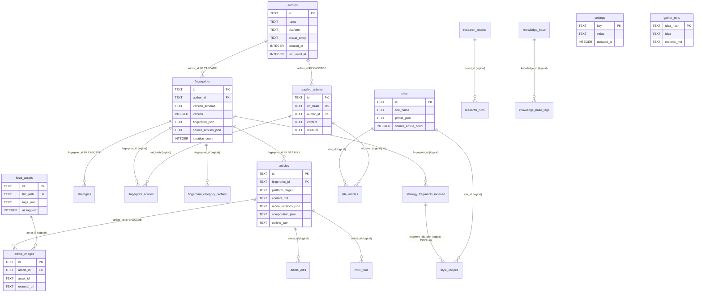

# 笔迹 ByTrace · 数据模型（DATA-MODEL）

> 本文档描述 **笔迹 ByTrace**（原 AutoArticle，仓库路径仍为 `autoarticle/`）运行时 SQLite 数据库的完整结构。
>
> **权威来源与生成方式**：本文逐行阅读了 `lib/`、`app/api/` 下的 schema 与查询代码后写成，**没有连接、没有查询、没有修改任何 `.db` 文件**，也没有执行任何迁移。所有表、列、索引、约束都以源码为唯一依据，并标注 `file:line`。
>
> 文中出现的一切路径、函数名、表名、列名都是**真实符号，未做重命名**；只有面向人的产品叙述使用「笔迹 ByTrace」。

---

## 0. 阅读须知

### 0.1 schema 分散在两个地方

这个项目**没有**单一 schema 文件。建表/扩列逻辑分布在 15 个文件里，共两类：

| 类型 | 机制 | 文件 |
|---|---|---|
| `.sql` 文件 | `getDb()` 启动时 `db.exec()`，靠 `CREATE TABLE IF NOT EXISTS` / `INSERT OR IGNORE` 幂等 | `lib/schema.sql`、`lib/schema-additions.sql`、`lib/schema-additions-images.sql`、`lib/schema-additions-sites.sql`、`lib/schema-additions-strategies.sql`、`lib/schema-additions-settings.sql`、`lib/schema-additions-v3.sql` |
| `ensureXxx()` TS 函数 | 用 `PRAGMA table_info` 探测后 `ALTER TABLE` / `CREATE TABLE IF NOT EXISTS`，幂等 | `lib/db.ts`（14 个函数）、`lib/schema-additions-critic.ts`、`lib/schema-additions-gather.ts`、`lib/schema-additions-knowledge-base.ts`、`lib/schema-additions-research.ts` |

**启动装载顺序**在 `lib/db.ts:397-500` 的 `getDb()` 里，一次写死、顺序固定：

```
resolveDbPath()                    db.ts:17-20
  → 设置 journal_mode=WAL / foreign_keys=ON   db.ts:404-405
  → schema.sql                     db.ts:407-408
  → schema-additions-images.sql    db.ts:412-416
  → schema-additions.sql           db.ts:419-423
  → schema-additions-sites.sql     db.ts:426-430
  → schema-additions-strategies.sql db.ts:433-437
  → schema-additions-settings.sql  db.ts:440-444
  → schema-additions-v3.sql        db.ts:447-451   （只有一句 SELECT 1 占位）
  → ensureFingerprintVersionColumns db.ts:454
  → ensureFingerprintV3Columns / ensureStrategyV3Columns db.ts:457-458
  → ensureCrawledArticlesMediumColumn db.ts:461
  → ensureArticleDiffsTable        db.ts:464
  → ensureSiteArticlesTable / ensureSiteArticlesPublishTimeColumn / ensureSitesIterationColumn db.ts:467-469
  → ensureFingerprintArticlesTable / ensureFingerprintIterationColumn db.ts:472-473
  → ensureFingerprintArticlesCategoryColumns / ensureFingerprintCategoryProfilesTable / ensureStrategyFragmentsIndexedTable db.ts:476-478
  → ensureStyleRecipesTable        db.ts:481
  → ensureCriticRunsTable          db.ts:484
  → ensureResearchTables           db.ts:487
  → ensureGatherRunsTable          db.ts:490
  → ensureKnowledgeBaseTable       db.ts:493
  → ensureLocalAssetsAiTaggedColumn db.ts:496
```

### 0.2 两个不在 `getDb()` 里的建表路径（容易漏）

- **`articles` 的 4 个扩展列**由 `lib/compose-schema.ts:10-29` 的 `ensureComposeColumns()` 添加，**不在 `getDb()` 里调用**，而是在每个用到的 API 路由入口各自调用一次：`app/api/compose/outline/route.ts:67`、`app/api/compose/draft/route.ts:237`、`app/api/compose/refine/route.ts:70`、`app/api/articles/[id]/diff/route.ts:86`、`app/api/articles/[id]/route.ts:22`。
- **`lib/schema-additions-compose.sql` 从不被 `db.exec()` 执行**。该文件头注释（`lib/schema-additions-compose.sql:1-10`）明确说明它只是"记录我们给 articles 加了哪些列"的文档，真正执行的是 `ensureComposeColumns()`。

### 0.3 SQLite 可空性提醒

本项目所有主键都是 `TEXT PRIMARY KEY`。SQLite 在普通 rowid 表上**不强制** `TEXT PRIMARY KEY` 非空（历史遗留行为），所以下表"可空"列里的"否"表示**代码约定/`NOT NULL` 约束**；带 `NOT NULL` 的列由 SQLite 强制，主键列则由应用层保证不写 NULL。

---

## 1. 表总览

| # | 表名 | 创建者 | 创建方式 | 用途 |
|---|---|---|---|---|
| 1 | `authors` | `lib/schema.sql:1-8` | `.sql` | 博主基本信息 |
| 2 | `fingerprints` | `lib/schema.sql:10-19` + `db.ts` 多次 ALTER | `.sql` + `ensureXxx()` | 风格指纹（v1/v2/v3 共存） |
| 3 | `articles` | `lib/schema.sql:21-31` + `compose-schema.ts` | `.sql` + `ensureXxx()` | 生成过的文章 |
| 4 | `crawled_articles` | `lib/schema-additions.sql:3-18` + `db.ts:377-382` | `.sql` + `ensureXxx()` | 爬虫落库正文 |
| 5 | `local_assets` | `lib/schema-additions-images.sql:4-17` + `db.ts:150-152` | `.sql` + `ensureXxx()` | 本地配图素材库 |
| 6 | `article_images` | `lib/schema-additions-images.sql:23-33` | `.sql` | 文章 ↔ 图片关联（**当前无代码读写**） |
| 7 | `sites` | `lib/schema-additions-sites.sql:16-26` + `db.ts:310-320` | `.sql` + `ensureXxx()` | 站点 × 板块画像 |
| 8 | `strategies` | `lib/schema-additions-strategies.sql:4-13` + `db.ts:117-138` | `.sql` + `ensureXxx()` | v2 策略碎片（**当前只写不读**） |
| 9 | `settings` | `lib/schema-additions-settings.sql:6-15` | `.sql` | k/v 全局偏好 |
| 10 | `fingerprint_articles` | `db.ts:166-184` + `db.ts:193-208` | `ensureXxx()` | 指纹 ↔ 样本关联 |
| 11 | `fingerprint_category_profiles` | `db.ts:215-230` | `ensureXxx()` | 按类别细分指纹 |
| 12 | `strategy_fragments_indexed` | `db.ts:261-288` | `ensureXxx()` | 跨博主可检索碎片库 |
| 13 | `style_recipes` | `db.ts:244-259` | `ensureXxx()` | 风格配方 |
| 14 | `site_articles` | `db.ts:331-345` + `db.ts:385-395` | `ensureXxx()` | 站点画像 ↔ 样本关联 |
| 15 | `article_diffs` | `db.ts:353-366` | `ensureXxx()` | 平台版本差异摘要缓存 |
| 16 | `critic_runs` | `lib/schema-additions-critic.ts:21-48` | `ensureXxx()` | Reflection Loop 评分记录 |
| 17 | `gather_runs` | `lib/schema-additions-gather.ts:21-32` | `ensureXxx()` | 按 `idea_hash` 的事实底座缓存 |
| 18 | `knowledge_base` | `lib/schema-additions-knowledge-base.ts:9-27` | `ensureXxx()` | 搜索素材资料库（**只写不读**） |
| 19 | `knowledge_base_tags` | `lib/schema-additions-knowledge-base.ts:30-37` | `ensureXxx()` | 资料标签（**只写不读**） |
| 20 | `research_reports` | `lib/schema-additions-research.ts:10-21` | `ensureXxx()` | 深度调研报告（**当前无代码读写**） |
| 21 | `research_runs` | `lib/schema-additions-research.ts:24-44` | `ensureXxx()` | 调研每轮明细（**当前无代码读写**） |

---

## 2. 表详解

### 2.1 `authors` — 博主

**创建者**：`lib/schema.sql:1-8`（`CREATE TABLE IF NOT EXISTS authors`）。

| 列 | SQL 类型 | 可空 | 默认 | 含义 |
|---|---|---|---|---|
| `id` | TEXT | 否（PK） | — | nanoid；v1 路由用 12 位（`app/api/fingerprint/route.ts:191`），v2/v3 用 12 位（`app/api/fingerprint/v3/route.ts` 内 `nanoid(12)`） |
| `name` | TEXT | 否（NOT NULL） | — | 博主名 |
| `platform` | TEXT | 是 | — | 平台 key，如 `wechat` / `zhihu` / `xhs`（`lib/platforms.ts:19-29` 的 `PlatformKey`）；v3 写入时取 `platforms_analyzed[0]` 作向后兼容（`app/api/fingerprint/v3/route.ts:595-600`） |
| `avatar_emoji` | TEXT | 是 | — | 单个汉字做头像，由 `pickAvatarChar(name)` 生成（`lib/authors/avatar.ts`） |
| `created_at` | INTEGER | 否（NOT NULL） | — | epoch ms |
| `last_used_at` | INTEGER | 是 | — | 最近一次被用于生成的时间；`/api/authors/[id]` PATCH 与 compose draft 都会更新 |

**主键**：`id`。
**索引**：无（`idx_fp_author` 是 `fingerprints.author_id` 的索引，不是本表）。
**外键**：无（被 `fingerprints.author_id`、`crawled_articles.author_id` 引用）。

**读写点**：
- 写：`app/api/fingerprint/route.ts:180-187`、`app/api/fingerprint/v2/route.ts:315-317`、`app/api/fingerprint/v3/route.ts:602-604`（三处都在事务里 INSERT，并同步插入指纹）。
- 改：`app/api/authors/[id]/route.ts:79`（改名 / 改平台，同步刷 `avatar_emoji`）。
- 读：`lib/fingerprint-queries.ts:35-57`（JOIN `fingerprints`）、`app/authors/[id]/page.tsx:102`、`app/fingerprints/[id]/page.tsx:171-179`。
- 删：`app/api/fingerprint/v3/[id]/route.ts:553-556`（先 `UPDATE crawled_articles SET author_id=NULL` 再删孤儿 author）。

**陷阱**：`authors` 表**没有** `source` / 来源列，尽管旧文档提到过。以源码为准：只有 6 列。

---

### 2.2 `fingerprints` — 风格指纹（v1/v2/v3 共存）

**创建者**：`lib/schema.sql:10-19` 建基表；随后由 `lib/db.ts` 的 4 个 `ensureXxx()` 幂等补列。

**基表列**（`lib/schema.sql:10-19`）：

| 列 | SQL 类型 | 可空 | 默认 | 含义 |
|---|---|---|---|---|
| `id` | TEXT | 否（PK） | — | nanoid(14) |
| `author_id` | TEXT | 否（NOT NULL） | — | → `authors.id`，**ON DELETE CASCADE**（`lib/schema.sql:12`） |
| `source_articles_json` | TEXT | 否（NOT NULL） | — | 拆解用的原始文章数组（JSON，见 §3.1） |
| `fingerprint_json` | TEXT | 否（NOT NULL） | — | 指纹主体（JSON，见 §3.2） |
| `raw_response` | TEXT | 是 | — | 模型原始流式输出（debug） |
| `model_version` | TEXT | 是 | — | 如 `claude-code-cli` / `claude-code-cli-v3` |
| `created_at` | INTEGER | 否（NOT NULL） | — | epoch ms |
| `hit_count` | INTEGER | 是 | `0` | 被 compose 使用次数；draft 落库时 `hit_count = hit_count + 1`（`app/api/compose/draft/route.ts:565`） |

**由 `ensureXxx()` 追加的列**：

| 列 | SQL 类型 | 可空 | 默认 | 追加位置 | 含义 |
|---|---|---|---|---|---|
| `version` | INTEGER | 是 | `1` | `db.ts:67-69` | 版本号 1/2/3；排序用（`lib/fingerprint-queries.ts:172` `ORDER BY COALESCE(f.version,1) DESC`） |
| `parent_id` | TEXT | 是 | — | `db.ts:70-72` | 优化流程里指向上一版指纹 id（`app/api/authors/[id]/optimize/route.ts:325-331`） |
| `article_count` | INTEGER | 是 | — | `db.ts:73-75` | 样本篇数；`lib/fingerprint-queries.ts` 与 authors 页优先读它，回退 `source_articles_json` 长度 |
| `version_schema` | TEXT | 是 | `'v1'` | `db.ts:92-95` | `'v1'` / `'v2'` / `'v3'`，UI 分支判据 |
| `platform_fingerprints_json` | TEXT | 是 | — | `db.ts:96-98` | v3 按平台分组指纹（冗余副本，见 §3.2） |
| `domain_variations_json` | TEXT | 是 | — | `db.ts:99-101` | v3 按领域偏移（冗余副本） |
| `cross_platform_report_json` | TEXT | 是 | — | `db.ts:102-104` | v3 跨平台报告（stage3 覆盖后写入） |
| `strategy_fragments_json` | TEXT | 是 | — | `db.ts:105-107` | v3 策略碎片库（冗余副本） |
| `iteration_count` | INTEGER | 是 | `1` | `db.ts:294-304` | 每次"加样本+重提炼"自增（`app/api/fingerprint/v3/[id]/route.ts:326`） |

**主键**：`id`。
**外键**：`author_id → authors(id) ON DELETE CASCADE`（`lib/schema.sql:12`）。
**索引**：`idx_fp_author ON fingerprints(author_id)`（`lib/schema.sql:33`）。

**读写点**：
- 写 v1：`app/api/fingerprint/route.ts:183-205`（`version` 走默认 1）。
- 写 v2：`app/api/fingerprint/v2/route.ts:319-322`（显式 `version=2`，**不写 `version_schema`**）。
- 写 v3：`app/api/fingerprint/v3/route.ts:606-612`（显式 `version=3`、`version_schema='v3'`，并写 4 个 v3 JSON 列）。
- 改 v3：`app/api/fingerprint/v3/[id]/route.ts:319-334`（`iteration_count = COALESCE(iteration_count,1)+1`）。
- 写优化版：`app/api/authors/[id]/optimize/route.ts:325-331`（`version = oldVersion+1`、`parent_id = 旧指纹 id`）。
- 读：`lib/fingerprint-queries.ts:31-60`、`app/fingerprints/[id]/page.tsx:169-179`、`app/authors/[id]/page.tsx:102`、`app/api/images/auto/route.ts:115`、prompt 组装（`lib/composition.ts:316`）。

**陷阱（重要）**：判别 v1/v2/v3 有**两个**列，语义不完全一致：
- UI 判 v3 用的是 `version_schema === 'v3'`（`app/fingerprints/[id]/page.tsx:222`）。
- 排序 / 取"最新一版"用的是数字 `version`（`lib/fingerprint-queries.ts:172-181`）。
- **v2 路由不写 `version_schema`**，所以 v2 行落库后 `version=2` 但 `version_schema='v1'`（列默认值，`db.ts:94`）。只靠 `version_schema` 无法区分 v2 与 v1，必须看 `version`。详见 §8。

---

### 2.3 `articles` — 生成的文章

**创建者**：`lib/schema.sql:21-31` 建基表；4 个扩展列由 `lib/compose-schema.ts:17-22` 的 `ensureComposeColumns()` 幂等补。

| 列 | SQL 类型 | 可空 | 默认 | 含义 |
|---|---|---|---|---|
| `id` | TEXT | 否（PK） | — | nanoid(14)（draft route）或 nanoid(14)（公众号草稿导入） |
| `fingerprint_id` | TEXT | 是 | — | → `fingerprints.id`，**ON DELETE SET NULL**（`lib/schema.sql:23`）。多博主 compose 只写 `composition.selected_authors[0]`（`app/api/compose/draft/route.ts:482`） |
| `platform_target` | TEXT | 是 | — | 主平台 key（英文 `PlatformKey`） |
| `layout_theme` | TEXT | 是 | — | `'standard'` / `'lively'` / `'minimal'`；draft route 恒写 `'standard'`（`app/api/compose/draft/route.ts:556`） |
| `title` | TEXT | 是 | — | 标题 |
| `content_md` | TEXT | 是 | — | **主平台**正文 Markdown |
| `content_html` | TEXT | 是 | — | 主平台正文 HTML（`markdownToHtml`） |
| `user_prompt` | TEXT | 是 | — | 用户输入；draft route 把 `idea` 同时写进这里（`app/api/compose/draft/route.ts:559`） |
| `created_at` | INTEGER | 否（NOT NULL） | — | epoch ms |
| `composition_json` | TEXT | 是 | — | 风格组合（`ensureComposeColumns`，`lib/compose-schema.ts:18`），见 §3.3 |
| `outline_json` | TEXT | 是 | — | 大纲（`lib/compose-schema.ts:19`），见 §3.4 |
| `idea` | TEXT | 是 | — | 用户最初输入的题材思路（`lib/compose-schema.ts:20`） |
| `refine_versions_json` | TEXT | 是 | — | 其它平台版本 + 润色历史（`lib/compose-schema.ts:21`），**双格式**，见 §3.5 |

**主键**：`id`。
**外键**：`fingerprint_id → fingerprints(id) ON DELETE SET NULL`（`lib/schema.sql:23`）。
**索引**：`idx_article_fp ON articles(fingerprint_id)`（`lib/schema.sql:34`）。

**读写点**：
- 写（新建）：`app/api/compose/draft/route.ts:545-563`（13 列 INSERT）。
- 写（多平台重跑）：`app/api/compose/draft/route.ts:485-523`（先 `SELECT ... refine_versions_json`，走 `parseRefineVersions()` 归一成 array 后回写）。
- 写（导入公众号草稿）：`app/api/import/wechat-draft/route.ts:57-64`（只写 6 列，`platform_target='wechat'`）。
- 改（润色追加）：`app/api/compose/refine/route.ts:158-176`。
- 读：`app/articles/page.tsx:162`、`app/api/articles/[id]/route.ts`、`app/api/compose/draft/route.ts:485`。
- 删：`app/api/articles/[id]/route.ts:153-156`（级联删 `article_diffs` + `critic_runs`）。

---

### 2.4 `crawled_articles` — 爬虫正文库

**创建者**：`lib/schema-additions.sql:3-18`；`medium` / `publish_time` 由 `db.ts:368-383` 的 `ensureCrawledArticlesMediumColumn()` 幂等补（`publish_time` 同时也写在 `.sql` 第 15 行，属双保险）。

| 列 | SQL 类型 | 可空 | 默认 | 含义 |
|---|---|---|---|---|
| `id` | TEXT | 否（PK） | — | nanoid |
| `author_id` | TEXT | 是 | — | → `authors.id`，**ON DELETE CASCADE**（`lib/schema-additions.sql:5`） |
| `url` | TEXT | 否（NOT NULL） | — | 原始 URL |
| `url_hash` | TEXT | 否（NOT NULL，**UNIQUE**） | — | URL 归一化后哈希（`lib/crawler/dedupe.ts` 的 `hashUrl`），全表去重键 |
| `title` | TEXT | 是 | — | 标题 |
| `content` | TEXT | 否（NOT NULL） | — | 正文 |
| `category` | TEXT | 是 | — | 分类 |
| `images_json` | TEXT | 是 | — | 图片数组 JSON，`{ url, alt }[]`（`lib/crawler/types.ts:10`） |
| `source_type` | TEXT | 否（NOT NULL） | — | 来源类型 |
| `used_in_fingerprint_id` | TEXT | 是 | — | 被哪份指纹用掉；**注意：没有声明外键**，只是普通 TEXT（`lib/schema-additions.sql:13`） |
| `crawled_at` | INTEGER | 否（NOT NULL） | — | epoch ms |
| `publish_time` | TEXT | 是 | — | 发布时间（字符串，原样存） |
| `medium` | TEXT | 是 | `'text'` | 内容载体 `text` / `video` / `mixed`（`db.ts:377-379`） |

**主键**：`id`。
**外键**：`author_id → authors(id) ON DELETE CASCADE`。
**索引**：`idx_crawled_author ON crawled_articles(author_id)`、`idx_crawled_url ON crawled_articles(url_hash)`（`lib/schema-additions.sql:20-21`）；另有 `url_hash UNIQUE` 带来的隐式唯一索引。

**读写点**：
- 写：`lib/sites/profile-engine.ts:112-115`（`INSERT OR IGNORE`，站点爬取）、`app/api/fingerprint/v2/route.ts:324-327`。
- 改：`app/api/authors/[id]/optimize/route.ts:335-338`（回填 `used_in_fingerprint_id`）、`app/api/fingerprint/v3/[id]/route.ts:553`（删 author 前置 `author_id=NULL`）。
- 读：`lib/sites/profile-engine.ts:209`（JOIN `site_articles` 拿历史样本）、`app/api/topics/trending/route.ts:153`（TF-IDF 热点）、`app/api/authors/[id]/optimize/route.ts:177`。

---

### 2.5 `local_assets` — 本地配图素材库

**创建者**：`lib/schema-additions-images.sql:4-17`；`ai_tagged` 由 `db.ts:146-153` 的 `ensureLocalAssetsAiTaggedColumn()` 追加。

| 列 | SQL 类型 | 可空 | 默认 | 含义 |
|---|---|---|---|---|
| `id` | TEXT | 否（PK） | — | nanoid |
| `file_path` | TEXT | 否（NOT NULL，**UNIQUE**） | — | 绝对路径；扫描时以此判重（`lib/images/scanner.ts:143-149`） |
| `file_name` | TEXT | 是 | — | 文件名 |
| `folder` | TEXT | 是 | — | 相对素材根的目录 |
| `width` | INTEGER | 是 | — | 恒为 NULL——扫描**不读 EXIF 不调 sharp**（`lib/images/scanner.ts:134-136` 注释） |
| `height` | INTEGER | 是 | — | 同上 |
| `size_bytes` | INTEGER | 是 | — | `fs.statSync().size` |
| `tags_json` | TEXT | 是 | — | 标签数组 JSON，`string[]`（`lib/images/local.ts:35-43`） |
| `visual_style` | TEXT | 是 | — | `实拍` / `插画` / `截图` / `数据图` / `其他` |
| `source` | TEXT | 否（NOT NULL） | — | `'local'` / `'crawled'` / `'unsplash-cache'` |
| `source_url` | TEXT | 是 | — | 来源 URL |
| `indexed_at` | INTEGER | 否（NOT NULL） | — | epoch ms |
| `ai_tagged` | INTEGER | 是 | `0` | `0`=扫描启发式打标，`1`=已经过 Claude 真视觉分类（`db.ts:141-152`） |

**主键**：`id`。
**索引**：`idx_assets_tags(tags_json)`、`idx_assets_source(source)`、`idx_assets_folder(folder)`（`lib/schema-additions-images.sql:19-21`）。

**读写点**：
- 写：`lib/images/scanner.ts:155-160`（`scanDirectory` INSERT），入口 `app/api/assets/scan/route.ts:52`、`app/api/scan-assets/route.ts:20`。
- 改：`lib/images/classify.ts:190`（Claude 视觉分类回写 `visual_style` / `tags_json` / `ai_tagged=1`）。
- 读：`lib/images/local.ts:96-114`（`searchLocalAssets`）、`lib/images/local.ts:133-141`（`getLocalAssetById`）、`app/api/tag-assets/route.ts:36`。

---

### 2.6 `article_images` — 文章 ↔ 图片关联（**当前是死表**）

**创建者**：`lib/schema-additions-images.sql:23-33`。

| 列 | SQL 类型 | 可空 | 默认 | 含义 |
|---|---|---|---|---|
| `id` | TEXT | 否（PK） | — | — |
| `article_id` | TEXT | 是 | — | → `articles.id`，**ON DELETE CASCADE**（`lib/schema-additions-images.sql:25`） |
| `slot_index` | INTEGER | 是 | — | 图槽序号 |
| `position_text` | TEXT | 是 | — | 段落开头 30 字 hash（注释原文） |
| `image_source` | TEXT | 是 | — | `'local'` / `'unsplash'` |
| `asset_id` | TEXT | 是 | — | `image_source='local'` 时指向 `local_assets.id` |
| `external_url` | TEXT | 是 | — | `image_source='unsplash'` 时用 |
| `caption` | TEXT | 是 | — | 图注 |
| `selected_at` | INTEGER | 是 | — | 选中时间 |

**主键**：`id`。
**外键**：`article_id → articles(id) ON DELETE CASCADE`。
**索引**：`idx_article_images_article ON article_images(article_id)`（`lib/schema-additions-images.sql:35`）。

**读写点**：**全仓库搜不到任何 `SELECT` / `INSERT` / `UPDATE` / `DELETE` 触及此表**（除建表语句本身与两份旧文档的表格）。`app/api/images/auto/route.ts` 只把候选图返回给前端（`POST` 响应体 `SlotResult[]`），**不落库**。详见 §8。

---

### 2.7 `sites` — 站点 × 板块画像

**创建者**：`lib/schema-additions-sites.sql:16-26`；`iteration_count` 由 `db.ts:310-320` 的 `ensureSitesIterationColumn()` 追加。

| 列 | SQL 类型 | 可空 | 默认 | 含义 |
|---|---|---|---|---|
| `id` | TEXT | 否（PK） | — | nanoid(14) |
| `site_name` | TEXT | 否（NOT NULL） | — | 站点名 |
| `section` | TEXT | 是 | — | 板块名 |
| `url_pattern` | TEXT | 是 | — | URL 通配 |
| `profile_json` | TEXT | 否（NOT NULL） | — | 画像主体（见 §3.6） |
| `source_url` | TEXT | 是 | — | 来源入口 URL |
| `source_article_count` | INTEGER | 是 | — | 真实 `COUNT(site_articles)`（`app/api/sites/route.ts:246-259`） |
| `created_at` | INTEGER | 否（NOT NULL） | — | epoch ms |
| `updated_at` | INTEGER | 是 | — | 最近更新 |
| `iteration_count` | INTEGER | 是 | `1` | 每轮"加样本+重提炼"+1（`db.ts:310-320`） |

**主键**：`id`。
**索引**：`idx_sites_pattern(url_pattern)`、`idx_sites_created(created_at DESC)`（`lib/schema-additions-sites.sql:28-29`）。

**读写点**：
- 写：`app/api/sites/route.ts:191-198`（先插占位 `profile_json='{}'`，再 UPDATE 真画像 `app/api/sites/route.ts:253-262`）；PATCH 在 `app/api/sites/[id]/route.ts:277`。
- 读：`app/sites/page.tsx:44`、`app/sites/[id]/page.tsx:67`、`app/api/sites/picker/route.ts:72`、`app/api/compose/draft/route.ts:271`、`app/api/compose/outline/route.ts:99`。
- 删：`app/api/sites/route.ts:201-226`、`app/api/sites/[id]/route.ts:93-94`（先删 `site_articles` 再删 `sites`）。

---

### 2.8 `strategies` — v2 策略碎片（**当前只写不读**）

**创建者**：`lib/schema-additions-strategies.sql:4-13`；4 个 v3 列由 `db.ts:117-138` 的 `ensureStrategyV3Columns()` 追加（注意该函数在 `PRAGMA` 返回空数组时直接 `return`，见 `db.ts:120-123`）。

| 列 | SQL 类型 | 可空 | 默认 | 含义 |
|---|---|---|---|---|
| `id` | TEXT | 否（PK） | — | nanoid(14) |
| `fingerprint_id` | TEXT | 是 | — | → `fingerprints.id`，**ON DELETE CASCADE**（`lib/schema-additions-strategies.sql:6`） |
| `tag` | TEXT | 是 | — | `opening` / `transition` / `closing` / `argument` / `language` / `visual` |
| `scope_json` | TEXT | 是 | — | 适用范围数组 JSON；v3 写入时取 `s.domain_scope ?? s.platform_scope ?? []`（`app/api/fingerprint/v3/route.ts:691`） |
| `description` | TEXT | 是 | — | 描述 |
| `example` | TEXT | 是 | — | 例文 |
| `when_to_use` | TEXT | 是 | — | 使用场景 |
| `created_at` | INTEGER | 否（NOT NULL） | — | epoch ms |
| `platform_scope_json` | TEXT | 是 | — | v3 适用平台数组（`db.ts:127`） |
| `domain_scope_json` | TEXT | 是 | — | v3 适用领域数组（`db.ts:130`） |
| `why_works` | TEXT | 是 | — | v3 生效原理（`db.ts:133`） |
| `title` | TEXT | 是 | — | v3 碎片名（`db.ts:136`） |

**主键**：`id`。
**外键**：`fingerprint_id → fingerprints(id) ON DELETE CASCADE`。
**索引**：`idx_strategies_fp ON strategies(fingerprint_id)`、`idx_strategies_tag ON strategies(tag)`（`lib/schema-additions-strategies.sql:15-16`）。

**读写点**：
- 写：`app/api/fingerprint/v2/route.ts:329-332`、`app/api/fingerprint/v3/route.ts:614-618`、`app/api/fingerprint/v3/[id]/route.ts:342-346`。
- 删：`app/api/fingerprint/v3/[id]/route.ts:340`（重提炼前清空）、`:542`（删指纹时）。
- 读：**没有任何 `SELECT ... FROM strategies`**。当前所有碎片检索走的是 `strategy_fragments_indexed`（`app/api/strategies/search/route.ts:79`）。详见 §8。

---

### 2.9 `settings` — 全局 k/v 偏好

**创建者**：`lib/schema-additions-settings.sql:6-10`；同文件 `:14-15` 用 `INSERT OR IGNORE` 播种 `default_theme='D'`。

| 列 | SQL 类型 | 可空 | 默认 | 含义 |
|---|---|---|---|---|
| `key` | TEXT | 否（PK） | — | 设置名 |
| `value` | TEXT | 否（NOT NULL） | — | 设置值 |
| `updated_at` | INTEGER | 否（NOT NULL） | — | epoch ms |

**主键**：`key`。**索引**：无。**外键**：无。

**已知 key**：
- `default_theme`：`'B'` / `'C'` / `'D'`，播种值 `'D'`（`lib/schema-additions-settings.sql:12-15`）。白名单校验在 `app/api/settings/route.ts:15-21`（`ALLOWED_KEYS` 与 `VALUE_VALIDATORS`）。

**读写点**：`getSetting`（`lib/db.ts:520-531`，调用方 `app/layout.tsx:21`）、`setSetting`（`lib/db.ts:536-543`）、`listSettings`（`lib/db.ts:548-556`，`GET /api/settings`）、`PATCH /api/settings`（`app/api/settings/route.ts:34-72`）。

**陷阱**：旧文档称 `apify_token` 也存这张表，但**当前代码里白名单只有 `default_theme`，且全仓库搜不到 `apify_token` 字样**。见 §8。

---

### 2.10 `fingerprint_articles` — 指纹 ↔ 样本关联

**创建者**：`lib/db.ts:166-184` 的 `ensureFingerprintArticlesTable()`；分类三列由 `lib/db.ts:193-208` 的 `ensureFingerprintArticlesCategoryColumns()` 追加。

| 列 | SQL 类型 | 可空 | 默认 | 含义 |
|---|---|---|---|---|
| `fingerprint_id` | TEXT | 否（NOT NULL，PK 之一） | — | → `fingerprints.id`（**未声明 FK**） |
| `url_hash` | TEXT | 否（NOT NULL，PK 之一） | — | 样本去重键；URL 模式哈希 URL，paste 模式哈希正文（`app/api/fingerprint/v3/route.ts:619-621` 注释） |
| `url` | TEXT | 是 | — | paste 模式为 NULL |
| `title` | TEXT | 是 | — | 标题 |
| `content` | TEXT | 否（NOT NULL） | — | **正文直接落表**，不依赖 `crawled_articles`，以支持 paste 模式（`lib/db.ts:163` 注释） |
| `platform` | TEXT | 是 | — | 平台 key |
| `medium` | TEXT | 是 | `'text'` | 载体 |
| `domain` | TEXT | 是 | — | 领域 |
| `source_mode` | TEXT | 否（NOT NULL） | `'url'` | `'url'` / `'paste'` |
| `added_at` | INTEGER | 否（NOT NULL） | — | epoch ms |
| `iteration` | INTEGER | 否（NOT NULL） | `1` | 1-based，第几轮加进来的 |
| `primary_category` | TEXT | 是 | — | Stage 0 主类（`db.ts:199`） |
| `secondary_category` | TEXT | 是 | — | 副类（`db.ts:202`） |
| `category_confidence` | TEXT | 是 | — | `high` / `medium` / `low`（`db.ts:205`） |

**主键**：复合 `(fingerprint_id, url_hash)`。
**外键**：无声明。
**索引**：`idx_fp_articles_fp ON fingerprint_articles(fingerprint_id)`（`db.ts:183`）、`idx_fp_articles_primary_cat ON fingerprint_articles(primary_category)`（`db.ts:207`）。

**读写点**：
- 写：`app/api/fingerprint/v3/route.ts:622-628`（首轮 `INSERT OR IGNORE`，`iteration=1`）、`app/api/fingerprint/v3/[id]/route.ts:196`（加样本）。
- 改：`app/api/fingerprint/v3/[id]/route.ts:336-338`（回写 Stage 0 分类）。
- 读：`app/fingerprints/[id]/page.tsx:185-192`、`lib/fingerprint-queries.ts:241`（拿 url 判平台）。
- 删：`app/api/fingerprint/v3/[id]/route.ts:540`（重提炼/删除时）。

---

### 2.11 `fingerprint_category_profiles` — 按类别细分指纹

**创建者**：`lib/db.ts:215-230` 的 `ensureFingerprintCategoryProfilesTable()`。

| 列 | SQL 类型 | 可空 | 默认 | 含义 |
|---|---|---|---|---|
| `fingerprint_id` | TEXT | 否（NOT NULL，PK 之一） | — | → `fingerprints.id`（未声明 FK） |
| `category` | TEXT | 否（NOT NULL，PK 之一） | — | 8 类白名单之一 |
| `profile_json` | TEXT | 否（NOT NULL） | — | 类别专属指纹（见 §3.7） |
| `sample_count` | INTEGER | 否（NOT NULL） | — | 该类别样本数（≥ 3 才生成，`lib/db.ts:213`） |
| `iteration` | INTEGER | 否（NOT NULL） | `1` | 轮次 |
| `updated_at` | INTEGER | 否（NOT NULL） | — | epoch ms |

**主键**：复合 `(fingerprint_id, category)`（`INSERT OR REPLACE` 覆盖写，`app/api/fingerprint/v3/route.ts:629`）。
**外键**：无声明。
**索引**：`idx_fp_cat_profiles_cat ON fingerprint_category_profiles(category)`（`db.ts:227-229`）。

**读写点**：写 `app/api/fingerprint/v3/route.ts:629-633`、`app/api/fingerprint/v3/[id]/route.ts:351-355`；读 `app/fingerprints/[id]/page.tsx:196-209`；删 `app/api/fingerprint/v3/[id]/route.ts:541`。

---

### 2.12 `strategy_fragments_indexed` — 跨博主可检索碎片库

**创建者**：`lib/db.ts:261-288` 的 `ensureStrategyFragmentsIndexedTable()`。

| 列 | SQL 类型 | 可空 | 默认 | 含义 |
|---|---|---|---|---|
| `id` | TEXT | 否（PK） | — | nanoid(14) |
| `fingerprint_id` | TEXT | 否（NOT NULL） | — | 出处指纹（未声明 FK） |
| `author_name` | TEXT | 是 | — | 出处博主名 |
| `category` | TEXT | 是 | — | 8 类之一；**NULL 表示"全类别"碎片** |
| `tag` | TEXT | 是 | — | 碎片类型 |
| `title` | TEXT | 是 | — | 碎片名 |
| `description` | TEXT | 是 | — | 描述 |
| `example` | TEXT | 是 | — | 例文 |
| `when_to_use` | TEXT | 是 | — | 使用场景 |
| `why_works` | TEXT | 是 | — | 生效原理 |
| `platform_scope_json` | TEXT | 是 | — | 适用平台数组 JSON |
| `domain_scope_json` | TEXT | 是 | — | 适用领域数组 JSON |
| `created_at` | INTEGER | 否（NOT NULL） | — | epoch ms |

**主键**：`id`。
**外键**：无声明。
**索引**：`idx_strat_frag_cat(category)`、`idx_strat_frag_tag(tag)`、`idx_strat_frag_fp(fingerprint_id)`（`db.ts:279-287`）。

**读写点**：
- 写：`app/api/fingerprint/v3/route.ts:634-638`、`app/api/fingerprint/v3/[id]/route.ts:364-368`。
- 删：`app/api/fingerprint/v3/[id]/route.ts:358-361`（分类重提炼时按 `category IS NULL` / `category = ?` 整组覆盖写）、`:543`。
- 读：`app/api/strategies/search/route.ts:79`、`app/api/recipes/route.ts:122`、`app/api/recipes/[id]/route.ts:88`。

---

### 2.13 `style_recipes` — 风格配方

**创建者**：`lib/db.ts:244-259` 的 `ensureStyleRecipesTable()`。

| 列 | SQL 类型 | 可空 | 默认 | 含义 |
|---|---|---|---|---|
| `id` | TEXT | 否（PK） | — | nanoid |
| `name` | TEXT | 否（NOT NULL） | — | 配方名 |
| `platform_key` | TEXT | 否（NOT NULL） | — | 绑定的平台 key |
| `site_id` | TEXT | 是 | — | 可选绑定站点（未声明 FK，API 层校验） |
| `fragment_ids_json` | TEXT | 否（NOT NULL） | — | `strategy_fragments_indexed.id` 的字符串数组 JSON（`db.ts:242`） |
| `notes` | TEXT | 是 | — | 备注 |
| `created_at` | INTEGER | 否（NOT NULL） | — | epoch ms |
| `updated_at` | INTEGER | 否（NOT NULL） | — | epoch ms |

**主键**：`id`。
**索引**：`idx_style_recipes_platform(platform_key)`、`idx_style_recipes_site(site_id)`（`db.ts:257-258`）。

**读写点**：`app/api/recipes/route.ts:73`（列表）、`:122-143`（新建，先校验碎片 id 存在）、`app/api/recipes/[id]/route.ts:75`（详情 join 碎片）、`:197`（编辑）、`:215`（删除）。

---

### 2.14 `site_articles` — 站点画像 ↔ 样本关联

**创建者**：`lib/db.ts:331-345` 的 `ensureSiteArticlesTable()`；`publish_time` 由 `db.ts:385-395` 的 `ensureSiteArticlesPublishTimeColumn()` 追加。

| 列 | SQL 类型 | 可空 | 默认 | 含义 |
|---|---|---|---|---|
| `site_id` | TEXT | 否（NOT NULL，PK 之一） | — | → `sites.id`（未声明 FK） |
| `url_hash` | TEXT | 否（NOT NULL，PK 之一） | — | 与 `crawled_articles.url_hash` 对齐（`JOIN` 见 `lib/sites/profile-engine.ts:209`） |
| `url` | TEXT | 否（NOT NULL） | — | 原始 URL |
| `title` | TEXT | 是 | — | 标题 |
| `added_at` | INTEGER | 否（NOT NULL） | — | epoch ms |
| `iteration` | INTEGER | 否（NOT NULL） | `1` | 1-based 轮次 |
| `publish_time` | TEXT | 是 | — | 发布时间（`db.ts:393`） |

**主键**：复合 `(site_id, url_hash)`。
**外键**：无声明。
**索引**：`idx_site_articles_site ON site_articles(site_id)`（`db.ts:344`）。

**读写点**：写 `lib/sites/profile-engine.ts:108-109`（`INSERT OR IGNORE`）；读 `lib/sites/profile-engine.ts:86-105`、`:209`；删 `app/api/sites/route.ts:202-226`、`app/api/sites/[id]/route.ts:93`。

---

### 2.15 `article_diffs` — 平台版本差异摘要缓存

**创建者**：`lib/db.ts:353-366` 的 `ensureArticleDiffsTable()`。

| 列 | SQL 类型 | 可空 | 默认 | 含义 |
|---|---|---|---|---|
| `article_id` | TEXT | 否（NOT NULL，PK 之一） | — | → `articles.id`（未声明 FK） |
| `from_platform` | TEXT | 否（NOT NULL，PK 之一） | — | 英文 `PlatformKey` |
| `to_platform` | TEXT | 否（NOT NULL，PK 之一） | — | 英文 `PlatformKey` |
| `from_hash` | TEXT | 否（NOT NULL） | — | `sha1(fromMd).slice(0,16)`（`app/api/articles/[id]/diff/route.ts:36-38`） |
| `to_hash` | TEXT | 否（NOT NULL） | — | 同上 |
| `summary_json` | TEXT | 否（NOT NULL） | — | `{ overview, adjustments[] }` JSON（见 §3.8） |
| `created_at` | INTEGER | 否（NOT NULL） | — | epoch ms |

**主键**：复合 `(article_id, from_platform, to_platform)`。
**索引**：**无额外索引**，仅主键。缓存校验靠 `from_hash` / `to_hash` 比对（`app/api/articles/[id]/diff/route.ts:126-133`），命中且 hash 一致才返缓存，否则重算并 UPSERT（`:166-173`）。

**读写点**：`app/api/articles/[id]/diff/route.ts:120-173`；删 `app/api/articles/[id]/route.ts:155`。

---

### 2.16 `critic_runs` — Reflection Loop 评分记录

**创建者**：`lib/schema-additions-critic.ts:21-48` 的 `ensureCriticRunsTable()`。

| 列 | SQL 类型 | 可空 | 默认 | 含义 |
|---|---|---|---|---|
| `article_id` | TEXT | 否（NOT NULL，PK 之一） | — | → `articles.id`（未声明 FK） |
| `platform` | TEXT | 否（NOT NULL，PK 之一） | — | 多平台时区分是哪个平台的评分 |
| `attempt` | INTEGER | 否（NOT NULL，PK 之一） | — | 1-based 次数 |
| `structure_score` | INTEGER | 否（NOT NULL） | — | 结构分 |
| `structure_reason` | TEXT | 是 | — | 结构理由 |
| `depth_score` | INTEGER | 否（NOT NULL） | — | 纵深分 |
| `depth_reason` | TEXT | 是 | — | 纵深理由 |
| `analogy_score` | INTEGER | 否（NOT NULL） | — | 物件类比分 |
| `analogy_reason` | TEXT | 是 | — | 类比理由 |
| `punchline_score` | INTEGER | 否（NOT NULL） | — | 金句分 |
| `punchline_reason` | TEXT | 是 | — | 金句理由 |
| `taboo_score` | INTEGER | 否（NOT NULL） | — | 禁忌分 |
| `taboo_reason` | TEXT | 是 | — | 禁忌理由 |
| `total_score` | INTEGER | 否（NOT NULL） | — | 总分 |
| `passed` | INTEGER | 否（NOT NULL） | — | 0/1 是否过线 |
| `weakest` | TEXT | 是 | — | 最弱维度 |
| `rewrite_hint` | TEXT | 是 | — | 重写提示整段 |
| `elapsed_ms` | INTEGER | 是 | — | critic 单次耗时 |
| `created_at` | INTEGER | 否（NOT NULL） | — | epoch ms |

**主键**：复合 `(article_id, platform, attempt)` → 天然"覆盖写"（`lib/schema-additions-critic.ts:12-16`）。
**索引**：`idx_critic_runs_article ON critic_runs(article_id)`（`:46-48`）。

**读写点**：写 `app/api/compose/draft/route.ts:578-588`（`ON CONFLICT(...) DO UPDATE`）；删 `app/api/articles/[id]/route.ts:156`。评分维度定义见 `lib/prompts/critic.ts:21`。

---

### 2.17 `gather_runs` — 事实底座缓存（按 `idea_hash`）

**创建者**：`lib/schema-additions-gather.ts:21-32` 的 `ensureGatherRunsTable()`。

| 列 | SQL 类型 | 可空 | 默认 | 含义 |
|---|---|---|---|---|
| `idea_hash` | TEXT | 否（PK） | — | `sha256(trim(idea)+'\n'+sourceHint).slice(0,16)`（见 `app/api/compose/gather/route.ts` 的哈希构造） |
| `idea` | TEXT | 否（NOT NULL） | — | 原始 idea 文本 |
| `material_md` | TEXT | 否（NOT NULL） | — | 素材包 Markdown（**不是 JSON**） |
| `chars` | INTEGER | 否（NOT NULL） | — | 字符数 |
| `elapsed_ms` | INTEGER | 是 | — | 搜集耗时 |
| `created_at` | INTEGER | 否（NOT NULL） | — | epoch ms |

**主键**：`idea_hash`。**外键**：无。
**索引**：`idx_gather_runs_created ON gather_runs(created_at DESC)`（`db.ts:32`）。

**读写点**：读缓存 `app/api/compose/gather/route.ts:89`；写 `:167-169`。命中即秒返，不重烧 codex 配额（见 `lib/schema-additions-gather.ts:6-14`）。

---

### 2.18 `knowledge_base` / `knowledge_base_tags` — 素材资料库（**只写不读**）

**创建者**：`lib/schema-additions-knowledge-base.ts:9-37` 的 `ensureKnowledgeBaseTable()`。

**`knowledge_base`**：

| 列 | SQL 类型 | 可空 | 默认 | 含义 |
|---|---|---|---|---|
| `id` | TEXT | 否（PK） | — | nanoid(14) |
| `topic` | TEXT | 否（NOT NULL） | — | `idea.slice(0,50)` |
| `category` | TEXT | 是 | — | 关键词启发式判类（`autoDetectCategory`） |
| `search_query` | TEXT | 否（NOT NULL） | — | 搜索 query |
| `raw_results_json` | TEXT | 否（NOT NULL） | — | 原始搜索结果数组 JSON（`FactSearchHit[]`） |
| `organized_content_md` | TEXT | 否（NOT NULL） | — | 整理后正文 Markdown |
| `keywords_json` | TEXT | 是 | — | 关键词数组 JSON |
| `source_urls_json` | TEXT | 是 | — | 来源 URL 数组 JSON |
| `char_count` | INTEGER | 否（NOT NULL） | `0` | 字符数 |
| `created_at` | INTEGER | 否（NOT NULL） | — | epoch ms |

主键 `id`；索引 `idx_kb_topic(topic)`、`idx_kb_category(category)`、`idx_kb_created(created_at)`（`:25-27`）。

**`knowledge_base_tags`**：

| 列 | SQL 类型 | 可空 | 默认 | 含义 |
|---|---|---|---|---|
| `knowledge_id` | TEXT | 否（NOT NULL，PK 之一） | — | → `knowledge_base.id`（未声明 FK） |
| `tag` | TEXT | 否（NOT NULL，PK 之一） | — | 标签（关键词或类别） |

主键复合 `(knowledge_id, tag)`；索引 `idx_kb_tags_tag(tag)`（`:37`）。

**读写点**：写 `app/api/compose/gather/route.ts:211-232`。**没有任何 `SELECT ... FROM knowledge_base`**。详见 §8。

---

### 2.19 `research_reports` / `research_runs` — 深度调研（**当前无代码读写**）

**创建者**：`lib/schema-additions-research.ts:8-45` 的 `ensureResearchTables()`。

**`research_reports`**（`:10-21`）：

| 列 | SQL 类型 | 可空 | 默认 | 含义 |
|---|---|---|---|---|
| `id` | TEXT | 否（PK） | — | 报告 id |
| `topic` | TEXT | 否（NOT NULL） | — | 选题 |
| `source_hint` | TEXT | 是 | — | 来源提示 |
| `gathered_md` | TEXT | 是 | — | 搜集结果 Markdown |
| `final_report_md` | TEXT | 是 | — | 终稿 Markdown |
| `final_attempt` | INTEGER | 否（NOT NULL） | `1` | 终稿来自第几轮 |
| `passed` | INTEGER | 否（NOT NULL） | `0` | 0/1 是否过线 |
| `created_at` | INTEGER | 否（NOT NULL） | — | epoch ms |

**`research_runs`**（`:24-44`）：

| 列 | SQL 类型 | 可空 | 默认 | 含义 |
|---|---|---|---|---|
| `report_id` | TEXT | 否（NOT NULL，PK 之一） | — | → `research_reports.id`（未声明 FK） |
| `attempt` | INTEGER | 否（NOT NULL，PK 之一） | — | 轮次 |
| `draft_md` | TEXT | 是 | — | 本轮草稿 |
| `review_json` | TEXT | 是 | — | 审查结果 JSON（issues / score / verdict） |
| `verdict` | TEXT | 是 | — | `pass` / `revise` |
| `issue_count` | INTEGER | 否（NOT NULL） | `0` | 问题数 |
| `high_count` | INTEGER | 否（NOT NULL） | `0` | 高危问题数 |
| `elapsed_ms` | INTEGER | 是 | — | 本轮耗时 |
| `created_at` | INTEGER | 否（NOT NULL） | — | epoch ms |
| `total_score` | INTEGER | 是 | — | 0-100 总分，best-of-N 选稿用；`ensureResearchTables` 幂等 ALTER 追加（`:41-44`） |

主键复合 `(report_id, attempt)`；索引 `idx_research_runs_report(report_id)`（`:38`）。

**读写点**：**全仓库（`app/` + `lib/`）搜不到任何对该两表的 `SELECT` / `INSERT` / `UPDATE` / `DELETE`**，只有建表代码本身。仓库里也**没有** `app/research/` 目录或 `app/api/research/` 路由。详见 §8。

---

## 3. JSON 列详解

> 规则：下面每个 key 都在源码里被真实读写过，并给出位置。凡是"只写不读"或"只读不写"的也一并标注。

### 3.1 `fingerprints.source_articles_json` — 样本摘要数组

**形状随版本不同**（都是 JSON 数组）：

| 版本 | 每项 key | 写入位置 |
|---|---|---|
| v1 | `{ title?, content }` | `app/api/fingerprint/route.ts:82-95`，序列化于 `:201` |
| v2 | `{ title, category, source, url, chars }` | `app/api/fingerprint/v2/route.ts:334-340` |
| v3 | `{ title, platform, domain, medium, url, chars }` | `app/api/fingerprint/v3/route.ts:640-646` |

**读取点**：
- `lib/fingerprint-queries.ts:66-72`：`JSON.parse` 后要求 `Array.isArray`，再逐项取 `.url`（缺 `url` 的项被过滤）→ 用于推断展示平台。
- `app/authors/[id]/page.tsx:155`：取数组长度作"总学习篇数"。
- `app/api/authors/[id]/optimize/route.ts:311-322`：读旧数组 + 追加新样本（合并）。
- `app/fingerprints/[id]/page.tsx:192-209` 附近的 `samples` 实际读的是 `fingerprint_articles` 表，不是这一列。

**陷阱**：v1 的项**没有 `url`**，所以 `displayPlatform()` 的 woshipm 嗅探（`lib/fingerprint-queries.ts:219-220`）对 v1 指纹失效，会回退到 `authors.platform`。

### 3.2 `fingerprints.fingerprint_json` — 指纹主体

**v1 / v2 顶层 key**（`lib/prompts/fingerprint.ts:56-90` 的 schema；类型声明见 `lib/composition.ts:38-69`）：

| key | 类型 | 读它的地方 |
|---|---|---|
| `author_summary` | string | `lib/composition.ts:111-113` |
| `language` | object `{sentence_length, vocabulary_register, verbal_tics[]}` | `lib/composition.ts:124-126`；雷达图 `lib/fingerprint-queries.ts:111` |
| `structure` | object `{opening_hook, transition_style, closing_pattern}` | `lib/composition.ts:128-131`；雷达图 `:112` |
| `topic` | object `{topic_preference, viewpoint_density, argumentation}` | `lib/composition.ts:133-136`；雷达图 `:113` |
| `visual` | object `{image_style, emoji_usage, layout_preference}` | `lib/composition.ts:138-141`；雷达图 `:114`；配图风格 `app/api/images/auto/route.ts:118`（读 `visual.image_style`） |
| `fingerprint_summary` | string | `lib/composition.ts:114-116` |
| `do_list` | string[] | `lib/composition.ts:143-145` |
| `dont_list` | string[] | `lib/composition.ts:146-148` |
| `verbal_tics` | string[] | 在 `language.verbal_tics` 内，未单独顶层读取 |
| `strategies` | array（**仅 v2**） | `lib/fingerprint-queries.ts:271`（`countFragments` 回退分支） |

**v3 新增顶层 key**（schema 见 `lib/prompts/fingerprint-v3-stage2.ts:76-171`）：

| key | 类型 | 读它的地方 |
|---|---|---|
| `platforms_analyzed` | string[] | `lib/fingerprint-queries.ts:250`（优先用它算已学平台）；`lib/composition.ts:49` |
| `domains_analyzed` | string[] | `lib/composition.ts:50` |
| `platform_fingerprints` | `Record<平台, object>` | `lib/composition.ts:219-278`、`lib/fingerprint-queries.ts:195,259`、`lib/prompts/refine.ts:171-177`、`app/fingerprints/[id]/page.tsx:230-232` |
| `domain_variations` | `Record<领域, object>` | `lib/composition.ts:52` |
| `cross_platform_report` | `{ summary, comparisons[], transferable_patterns[] }` | `lib/composition.ts:220-258`、`lib/prompts/refine.ts:177-180` |
| `strategy_fragments` | `{tag, platform_scope[], domain_scope[], title, description, example, when_to_use, why_works}[]` | `lib/composition.ts:262-278`、`lib/fingerprint-queries.ts:269` |
| `structure_repertoire` | `{ dominant_shape, shapes[] }` | `lib/prompts/article.ts:200-204`、`lib/prompts/outline.ts:202`、`lib/prompts/critic.ts:201` |
| `depth_pattern` | `{ average_layers, max_layers, drilling_phrases[], ... }` | 同上（`lib/prompts/article.ts:206`、`lib/prompts/outline.ts:205`、`lib/prompts/critic.ts:202`） |
| `analogy_bank` | string[] | 同上（`lib/prompts/article.ts:206`、`lib/prompts/outline.ts:208`、`lib/prompts/critic.ts:205`） |
| `user_facing_summary` | string | `lib/composition.ts:68` |

**重要位置提醒**（旧文档已订正多次，此处再确认）：`structure_repertoire` / `depth_pattern` / `analogy_bank` 写在 `fingerprint_json` **顶层**，不在 `platform_fingerprints[平台]` 下。三个读点（`lib/prompts/article.ts:198-208`、`lib/prompts/outline.ts:200-210`、`lib/prompts/critic.ts:199-206`）都直接读顶层。

**冗余副本**：v3 写入时把 `platform_fingerprints` / `domain_variations` / `cross_platform_report` / `strategy_fragments` 四个 key **再单独序列化一份**到 4 个独立列（`app/api/fingerprint/v3/route.ts:673-687`）。stage3 的跨平台报告会覆盖 `fingerprint.cross_platform_report`（`lib/fingerprints/v3-engine.ts:465`），而 `cross_platform_report_json` 列存的是 stage3 之后的值。**当前代码读这 4 列的地方极少**——主要读 `fingerprint_json` 本体。见 §8。

### 3.3 `articles.composition_json` — 风格组合

**形状**（`lib/composition.ts:16-35`）：

```json
{
  "selected_authors": [
    { "author_id": "…", "fingerprint_id": "…", "weight": 0.6, "use_strategies": ["language","structure"] }
  ],
  "custom_notes": "用户额外说明（最高优先级）"
}
```

- `weight` 为 0-1，prompt 里转百分比；**不要求总和为 1**（`lib/composition.ts:9-13`）。
- `use_strategies` 可选值 = `language` / `structure` / `topic` / `visual` / `do_list` / `dont_list`（`lib/composition.ts:23-28`）。
- 写入：`app/api/compose/draft/route.ts:556`（`JSON.stringify(composition)`）。
- 读取：`lib/composition.ts:85-165` 的 `buildCompositionSystemSnippet()` 还原成 system 段落。

### 3.4 `articles.outline_json` — 大纲

**形状**（schema 见 `lib/prompts/outline.ts:128-145`）：

```json
{
  "working_title": "…",
  "core_thesis": "…",
  "structure_shape": "causal_chain / dual_contrast / concentric / flat_list / timeline / problem_solution",
  "hook_idea": "…",
  "sections": [
    { "index": 1, "title": "…", "thesis": "…", "depth_role": "open|deeper|parallel|turn|close",
      "bullets": ["…"], "word_budget": 800 }
  ],
  "closing_idea": "…",
  "total_words_estimate": 3200
}
```

- **写入**：`app/api/compose/draft/route.ts:557`（`JSON.stringify(outline)`）。
- `depth_role` 是 v3.3 硬约束：禁止整篇全 `parallel`，至少一节 `deeper`（`lib/prompts/outline.ts:154`）。

### 3.5 `articles.refine_versions_json` — 双格式列（**必须走统一解析**）

这是全库最容易踩坑的列。历史上有两种形态并存：

**形态 A · dict**（draft route 一次出 N 版时写）：

```json
{ "zhihu": "…md…", "xhs": "…md…" }
```

写入位置：`app/api/compose/draft/route.ts:527-541`（只有主平台之外还有版本时非 null）。

**形态 B · array**（refine 润色历史 / draft 重跑时写）：

```json
[
  { "ts": 1717000000000, "source_platform": "wechat", "target_platform": "zhihu", "content_md": "…md…" }
]
```

`RefineVersionEntry` 类型定义在 `lib/refine-versions.ts:14-19`。写入位置：`app/api/compose/refine/route.ts:158-176`（追加）、`app/api/compose/draft/route.ts:496-522`（多平台重跑，先归一再整列回写）。

**统一解析函数**：`parseRefineVersions(raw, { fallbackTs, mainPlatform })`（`lib/refine-versions.ts:35-77`）：
- array → 原样返回并过滤结构不完整项（`:48-56`）。
- dict → 转成 array entry，`target_platform` 取 dict key（经 `resolvePlatformKey`），`source_platform` 用 `mainPlatform` 兜底，`ts` 用 `fallbackTs` 兜底（`:59-74`）。
- `null` / 坏 JSON / 标量 → `[]`（`:39-45, :76`）。

**三个调用方（必须继续共用它）**：
1. `app/api/compose/refine/route.ts:158-165`（写前归一，避免整列覆盖抹掉 dict 版本）
2. `app/api/articles/[id]/diff/route.ts:113-117`（读多平台版本）
3. `app/articles/page.tsx:92-94`（历史列表页）

**不要**在调用方手写 `JSON.parse` + `Array.isArray`（`lib/refine-versions.ts:8-9` 明确禁止）。

### 3.6 `sites.profile_json` — 站点画像

**形状**（schema 见 `lib/prompts/siteprofile.ts:79-103`）：

| key | 类型 | 备注 |
|---|---|---|
| `site_name` | string | |
| `section` | string | |
| `url_pattern` | string | |
| `preferred_topics` | string[] | 3-5 个 |
| `title_patterns` | string[] | 3-5 个 |
| `word_count_range` | `[number, number]` | 两元素整数数组 |
| `image_density` | string | 高/中/低/无图 + 说明 |
| `opening_pattern` | string | |
| `closing_pattern` | string | |
| `tone` | string | |
| `key_phrases` | string[] | 5-8 个 |
| `preferred_structures` | `{shape, share, example_title}[]` | v3.3 新增，1-3 个 |
| `preferred_depth` | string | v3.3 新增 |
| `analogy_density` | string | v3.3 新增 |

**读取点**：`app/sites/page.tsx:55`、`app/sites/[id]/page.tsx:78`、`app/api/compose/draft/route.ts:271-274`、`app/api/compose/outline/route.ts:99`，以及 prompt 组装 `lib/prompts/article.ts:230-246`、`lib/prompts/outline.ts:247-254`。

**注意**：`lib/schema-additions-sites.sql:11-15` 的注释里的 key 列表是**旧版**（没有 v3.3 的三个字段）。以 `lib/prompts/siteprofile.ts` 为准。

### 3.7 `fingerprint_category_profiles.profile_json` — 类别专属指纹

**形状**（类型见 `app/fingerprints/[id]/page.tsx:48-66`）：

```
category, sample_count, summary, what_makes_this_category_unique,
preferred_opening, preferred_argumentation, preferred_closing,
tone_for_this_category, recommended_when,
category_specific_fragments: [{ tag, title, description, example, when_to_use, why_works }]
```

`category_specific_fragments` 会被展平写进 `strategy_fragments_indexed`（带 `category`）：`app/api/fingerprint/v3/route.ts:731-745`、`app/api/fingerprint/v3/[id]/route.ts:451-465`。

### 3.8 `article_diffs.summary_json`

```json
{ "overview": "一句话总述", "adjustments": ["调整点 1", "调整点 2"] }
```

- 解析 / 校验：`app/api/articles/[id]/diff/route.ts:55-69`（`overview` 必须 string、`adjustments` 必须非空字符串数组，否则视为无效并重算）。
- 写入：`:166-173`。

### 3.9 `crawled_articles.images_json`

`{ url: string; alt: string | null }[]`（类型定义 `lib/crawler/types.ts:10`）。

### 3.10 `local_assets.tags_json`

`string[]`。读取时 `Array.isArray` 过滤非字符串（`lib/images/local.ts:35-43`）；写入时与已有标签合并去重（`lib/images/classify.ts:164-190`）。

### 3.11 `style_recipes.fragment_ids_json`

`string[]`，元素必须是已存在的 `strategy_fragments_indexed.id`。新建/编辑前会校验 id 存在（`app/api/recipes/route.ts:122`、`app/api/recipes/[id]/route.ts:174`）。

### 3.12 `strategy_fragments_indexed.platform_scope_json` / `domain_scope_json`

`string[]`；解析用 `safeParseArray`（`app/api/strategies/search/route.ts:99-100`），支持按平台字符串包含匹配（`:18` 注释）。

### 3.13 `knowledge_base.raw_results_json` / `keywords_json` / `source_urls_json`

- `raw_results_json`：搜索结果数组 `FactSearchHit[]`（写入 `app/api/compose/gather/route.ts:220-224`）。
- `keywords_json`：`string[]`。
- `source_urls_json`：`string[]`（来自 `searchResults.map(r => r.url)`）。

### 3.14 `research_runs.review_json`

codex 审查输出 JSON（issues / score / verdict）；`total_score` 由审查结果单独落列（`lib/schema-additions-research.ts:40-44` 的注释）。**当前无代码写入**（见 §8）。

---

## 4. ER 图

下图只画**代码里真实存在的关系**。其中 5 条是数据库层面声明的外键（`REFERENCES`），其余是代码里真实使用、但没有声明 FK 的逻辑关联（已在下图后用文字区分）。



**数据库层真实声明了 `REFERENCES` 的 5 条**：

| 关系 | 声明位置 | ON DELETE |
|---|---|---|
| `fingerprints.author_id → authors.id` | `lib/schema.sql:12` | `CASCADE` |
| `articles.fingerprint_id → fingerprints.id` | `lib/schema.sql:23` | `SET NULL` |
| `crawled_articles.author_id → authors.id` | `lib/schema-additions.sql:5` | `CASCADE` |
| `strategies.fingerprint_id → fingerprints.id` | `lib/schema-additions-strategies.sql:6` | `CASCADE` |
| `article_images.article_id → articles.id` | `lib/schema-additions-images.sql:25` | `CASCADE` |

其余都是**逻辑关联**（普通 TEXT 列，无 FK 约束），删除时由应用层手写级联（例如 `app/api/fingerprint/v3/[id]/route.ts:540-544` 依次删 5 张表；`app/api/articles/[id]/route.ts:153-156` 依次删 articles + article_diffs + critic_runs；`app/api/sites/route.ts:201-208` 先删 site_articles 再删 sites）。

> `settings`、`gather_runs`、`knowledge_base`、`research_*` 与其它表没有外键关系；`gather_runs` 按 `idea_hash` 自洽。

---

## 5. 数据生命周期

### 5.1 一次完整 compose 的写入路径

```
① 爬虫 / 手贴样本
   crawlArticle()  →  lib/sites/profile-engine.ts:112  INSERT OR IGNORE crawled_articles
   （url_hash 唯一，重复抓自动跳过；medium/publish_time 一并落库）
                    →  lib/sites/profile-engine.ts:108  INSERT OR IGNORE site_articles
                       落 crawled_articles

② 指纹拆解
   POST /api/fingerprint/v3
     → runV3Extraction()                     lib/fingerprints/v3-engine.ts:405
       Stage 0 分类 → stage1 逐篇 → stage2 合成 → (≥2 平台时) stage3 跨平台
     → app/api/fingerprint/v3/route.ts:602-745（单事务）
       INSERT authors
       INSERT fingerprints（version=3, version_schema='v3', fingerprint_json + 4 个 v3 JSON 列）
       INSERT fingerprint_articles（每篇样本一行，含 Stage 0 分类）
       INSERT OR REPLACE fingerprint_category_profiles（单类 ≥3 篇时）
       INSERT strategy_fragments_indexed（全类别碎片 + 各分类碎片）
       INSERT strategies（同批碎片，冗余）
       UPDATE crawled_articles.used_in_fingerprint_id（仅 optimize 流程）

③ 事实底座（与 ④ 并行，idea 确认即后台起跑）
   POST /api/compose/gather
     → 命中 gather_runs.idea_hash ？秒返：否则 codex 联网搜集
     → INSERT gather_runs（material_md 素材包）
     → INSERT knowledge_base + knowledge_base_tags

④ 大纲
   POST /api/compose/outline
     → ensureComposeColumns()        lib/compose-schema.ts:10
     → SELECT sites.profile_json 注入站点画像     app/api/compose/outline/route.ts:99
     → SELECT fingerprints.fingerprint_json 注入博主结构能力
     → 流式返回 outline（此时不落库）

⑤ 正文（多平台串行）
   POST /api/compose/draft
     → ensureComposeColumns()
     → per-platform: streamClaude（Sonnet 4.6，240s）→ critic 循环（≤2 次重写）
     → INSERT articles（content_md=主平台正文，content_html，composition_json，outline_json，idea，
                        refine_versions_json=其它平台 dict）
     → UPDATE fingerprints.hit_count + 1 / UPDATE authors.last_used_at
     → INSERT critic_runs（每平台每次 attempt 一行，ON CONFLICT 覆盖）

⑥ 配图（可选）
   POST /api/images/auto
     → SELECT fingerprints.fingerprint_json 取 visual.image_style
     → 本地 local_assets 检索 + Unsplash 补
     → 结果直接返前端；**不写 article_images**（见 §8）

⑦ 跨平台差异
   POST /api/articles/[id]/diff
     → 读 articles.content_md + parseRefineVersions(refine_versions_json)
     → 模型算摘要 → INSERT/UPSERT article_diffs（from_hash/to_hash 校验）
```

### 5.2 读取路径

```
/articles 历史页        SELECT articles.*                     app/articles/page.tsx:162
                        parseRefineVersions(refine_versions_json)  :92-94
/articles/[id] 详情      SELECT articles + article_diffs      app/api/articles/[id]/route.ts
/articles/[id] diff      SELECT articles.refine_versions_json → parseRefineVersions
                        SELECT article_diffs（hash 命中即缓存）  diff/route.ts:120-133
/compose Step 1          SELECT sites.profile_json             app/api/sites/picker/route.ts:72
/compose Step 2-3        SELECT fingerprints.fingerprint_json   lib/composition.ts:316
/fingerprints 列表       SELECT fingerprints JOIN authors       lib/fingerprint-queries.ts:31-60
/fingerprints/[id]       SELECT fingerprints + fingerprint_articles
                        + fingerprint_category_profiles       app/fingerprints/[id]/page.tsx:169-209
/strategies 检索         SELECT strategy_fragments_indexed     app/api/strategies/search/route.ts:79
/recipes                 SELECT style_recipes
                        + strategy_fragments_indexed（按 id 列表 join）  app/api/recipes/[id]/route.ts:75-90
/topics 热点             SELECT crawled_articles               app/api/topics/trending/route.ts:153
/settings 主题           getSetting('default_theme')           lib/db.ts:520 → app/layout.tsx:21
配图                     SELECT local_assets                   lib/images/local.ts:96-114
```

### 5.3 缓存 / 去重键一览

| 缓存 | 键 | 失效条件 | 位置 |
|---|---|---|---|
| `gather_runs` | `idea_hash` = `sha256(trim(idea)+'\n'+sourceHint).slice(0,16)` | 改 idea 自然换 hash；无 TTL，靠 `created_at` 在 UI 提示时效 | `app/api/compose/gather/route.ts:89,167` |
| `article_diffs` | `(article_id, from_platform, to_platform)` + `from_hash` / `to_hash` | 任一平台正文变了 → hash 不匹配 → 重算覆盖 | `app/api/articles/[id]/diff/route.ts:126-133,166-173` |
| `crawled_articles` | `url_hash` UNIQUE | 永久去重；URL 归一化需先剥 `#rd`（旧文档记载的坑） | `lib/schema-additions.sql:7` |
| `fingerprint_articles` | `(fingerprint_id, url_hash)` | 同一指纹内同篇不重复 | `lib/db.ts:180` |
| `site_articles` | `(site_id, url_hash)` | 同一站点内同篇不重复 | `lib/db.ts:341` |
| `local_assets` | `file_path` UNIQUE | 重扫跳过已有 | `lib/schema-additions-images.sql:6` |
| `critic_runs` | `(article_id, platform, attempt)` | UPSERT 覆盖 | `lib/schema-additions-critic.ts:43` |
| `research_runs` | `(report_id, attempt)` | UPSERT 覆盖（当前未使用） | `lib/schema-additions-research.ts:35` |
| `fingerprint_category_profiles` | `(fingerprint_id, category)` | `INSERT OR REPLACE` 覆盖 | `lib/db.ts:224` |
| `strategy_fragments_indexed` | 逻辑分组：`fingerprint_id` + `category` | 重提炼前先 DELETE 该组再插 | `app/api/fingerprint/v3/[id]/route.ts:358-361` |

### 5.4 删除级联（应用层手写，因为多数表没有 FK）

| 删除动作 | 连带删除 | 位置 |
|---|---|---|
| 删 fingerprint（v3 API） | `fingerprint_articles` → `fingerprint_category_profiles` → `strategies` → `strategy_fragments_indexed` → `fingerprints`；`crawled_articles.author_id=NULL`；无指纹的 author 一并删 | `app/api/fingerprint/v3/[id]/route.ts:540-556` |
| 删 article | `article_diffs` + `critic_runs` + `articles` | `app/api/articles/[id]/route.ts:153-156` |
| 删 site | `site_articles` + `sites` | `app/api/sites/route.ts:201-226`、`app/api/sites/[id]/route.ts:93-94` |
| 删 recipe | 仅 `style_recipes`（碎片本体不动） | `app/api/recipes/[id]/route.ts:215` |
| 删 author（间接） | `fingerprints` / `crawled_articles` 由 FK CASCADE 自动删 | `lib/schema.sql:12`、`lib/schema-additions.sql:5` |

---

## 6. 迁移规则

### 6.1 硬规则原文

> **新增列必须走 `lib/db.ts` 里幂等的 `ensureXxx()`，绝不能改顶层 `lib/schema.sql`。**

这条规则在项目文档里反复出现（`CLAUDE.md` / `AGENTS.md` 的「关键模块」与「给下次的你」两节），根因写在源码注释里：

- `lib/schema-additions-compose.sql:4-6`：
  > SQLite 不支持 `ALTER TABLE ... ADD COLUMN IF NOT EXISTS`，所以这些语句必须由代码先用 `PRAGMA table_info(articles)` 看一下再决定要不要 exec。
- `lib/db.ts:57-60`：
  > SQLite 不支持 `ADD COLUMN IF NOT EXISTS`，所以先 PRAGMA 看一眼现有列。
- `lib/schema-additions-sites.sql:7-8`：
  > `fingerprints` 的 version/parent_id/article_count 三列由 db.ts 通过 PRAGMA 检测后 ALTER TABLE 加入。

### 6.2 为什么（existing DBs）

`getDb()` 每次进程启动都会**重新执行全部 schema 语句**（`lib/db.ts:407-451`）。这意味着：

1. **`.sql` 里只能是幂等语句**（`CREATE TABLE IF NOT EXISTS` / `CREATE INDEX IF NOT EXISTS` / `INSERT OR IGNORE` / 无副作用的 `SELECT 1`），否则第二次启动就报错。
2. **`CREATE TABLE IF NOT EXISTS` 对已存在的表是空操作**——它**不会**给老表补新列。已经落地的 `data/autoarticle.db` 里 `fingerprints` 是旧版结构，若把新列写进 `schema.sql` 的 `CREATE TABLE`，**老库永远不会拿到这一列**，而新库会拿到，造成"新老库结构不一致 + 代码在两类库上行为不同"。
3. 因此"给老表加列"只能靠**运行期探测**：`PRAGMA table_info(<表>)` 拿到现有列名集合 → 缺哪个就 `ALTER TABLE ... ADD COLUMN`。这正是所有 `ensureXxx()` 的写法。
4. 项目**不做版本号迁移框架**，靠"每次启动把所有 `ensureXxx()` 跑一遍（不重不漏）"达成幂等收敛。新增补列/建表函数必须**同时**在 `getDb()` 末尾加一行调用。

### 6.3 真实代码模式（三个层级的例子）

**A. 补列（最常见）——`ensureFingerprintV3Columns`（`lib/db.ts:86-108`）**

```ts
function ensureFingerprintV3Columns(db: Database.Database) {
  const cols = db
    .prepare(`PRAGMA table_info(fingerprints)`)
    .all() as { name: string }[];
  const names = new Set(cols.map((c) => c.name));

  if (!names.has('version_schema')) {
    // 给老数据一个默认值 'v1'，新写入的 v2 / v3 路由会显式覆盖。
    db.exec(`ALTER TABLE fingerprints ADD COLUMN version_schema TEXT DEFAULT 'v1'`);
  }
  if (!names.has('platform_fingerprints_json')) {
    db.exec(`ALTER TABLE fingerprints ADD COLUMN platform_fingerprints_json TEXT`);
  }
  …
}
```

**B. 惰性保护——表还没建时直接 return，等下一轮**

`ensureStrategyV3Columns`（`lib/db.ts:117-138`）与 `ensureLocalAssetsAiTaggedColumn`（`db.ts:146-153`）都先判断表是否存在：

```ts
const cols = db.prepare(`PRAGMA table_info(strategies)`).all() as { name: string }[];
if (cols.length === 0) return; // 表还没建，下次 getDb() 再补
```

`ensureCrawledArticlesMediumColumn`（`db.ts:368-383`）则先查 `sqlite_master`：

```ts
const tbl = db
  .prepare(`SELECT name FROM sqlite_master WHERE type='table' AND name='crawled_articles'`)
  .get();
if (!tbl) return;
```

**C. 建表 + 建索引（也是幂等）——`ensureFingerprintArticlesTable`（`lib/db.ts:166-184`）**

```ts
db.exec(`
  CREATE TABLE IF NOT EXISTS fingerprint_articles (
    …
    PRIMARY KEY (fingerprint_id, url_hash)
  )
`);
db.exec(`CREATE INDEX IF NOT EXISTS idx_fp_articles_fp ON fingerprint_articles(fingerprint_id)`);
```

**D. 复合场景——既建表又补列，且补列后立刻建索引**

`ensureResearchTables`（`lib/schema-additions-research.ts:8-45`）在建完两张表后，对 `research_runs` 再做一次 PRAGMA 补 `total_score`；`ensureFingerprintArticlesCategoryColumns`（`lib/db.ts:193-208`）补完三列后无条件重建分类索引。

### 6.4 新增列 / 新表的操作清单

1. 在 `lib/db.ts`（或对应的 `lib/schema-additions-*.ts`）新增一个 `ensureXxx(db)` 函数，用「PRAGMA + `if (!names.has(...))` + `ALTER TABLE`」或「`CREATE TABLE IF NOT EXISTS`」实现。
2. 在 `getDb()` 末尾（`lib/db.ts:453-496` 这一段）**加一行调用**，否则永远不会执行。
3. **不要**改 `lib/schema.sql` 里已存在表的 `CREATE TABLE`。
4. 改完后跑 `npx tsc --noEmit`。

### 6.5 唯一的例外（且已被注释警告）

`lib/schema-additions-compose.sql` 里有裸 `ALTER TABLE articles ADD COLUMN ...`（`:13-22`），但该文件**不被 `db.exec()` 加载**，文件头 `:8-10` 明确写着"这里只是记录我们对 articles 表新增了哪些列，不直接被 db.ts 里的 schema.sql 加载流程吃"。真正生效的是 `ensureComposeColumns()`。所以它不违反规则，只是文档。

---

## 7. 数据文件位置

### 7.1 路径解析

```ts
// lib/db.ts:17-20
function resolveDbPath(): string {
  // 在 Next.js 运行时 process.cwd() 指向项目根（autoarticle/）
  return join(process.cwd(), 'data', 'autoarticle.db');
}
```

`getDb()` 在打开前会确保父目录存在（`lib/db.ts:50-55` `ensureDataDir` → `mkdirSync(dir, { recursive: true })`，调用点 `:401`）。

因此数据库文件是：

```
<repo>/data/autoarticle.db        主库文件
<repo>/data/autoarticle.db-wal    Write-Ahead Log（未 checkpoint 的新数据）
<repo>/data/autoarticle.db-shm    共享内存索引
```

> 本机实测（2026-09 目录列表）：`data/autoarticle.db`（≈4.5 MB）、`data/autoarticle.db-wal`（≈2.2 MB）、`data/autoarticle.db-shm`（32 KB）三者同时存在，符合 WAL 模式预期。`data/.gitkeep` 与 `data/assets/`、`data/xiaopu-article-kb/`、`data/xiaopu-skill/` 也在此目录下，但不是 SQLite 的一部分。

### 7.2 WAL 模式与 `foreign_keys`

```ts
// lib/db.ts:403-405
const db = new Database(dbPath);
db.pragma('journal_mode = WAL');
db.pragma('foreign_keys = ON');
```

两个 pragma 都在**每个进程打开连接时**设置（`getDb()` 单例，`lib/db.ts:15` 的 `_db`；测试/热重载用 `closeDb()` 关闭，`lib/db.ts:505-510`）。

- `journal_mode = WAL` 是**持久化**到库文件的设置；`-wal` / `-shm` 兄弟文件是它的运行时产物。
- `foreign_keys = ON` 是**连接级**设置，必须每次连接都开——这就是上面 5 条 FK 级联（`authors` / `fingerprints` / `articles` / `strategies` / `article_images`）真正生效的前提。任何绕过 `getDb()` 直连 sqlite3 的操作，级联都不会触发。

### 7.3 ⚠️ 绝对不要手动删 `-wal`

- `data/autoarticle.db-wal` 里装着**尚未 checkpoint 到主库**的已提交事务。手删 `-wal` = 直接丢数据，且可能让主库处于不一致状态。
- 同理 `-shm` 也不要单独删。
- 要重置数据库，必须**整个 `data/` 目录一起处理**（并确保没有 dev / next-server 进程仍持有连接，`fuser data/autoarticle.db` 可查锁）。
- 项目文档（`CLAUDE.md` / `AGENTS.md`「已知非阻塞问题」）已把这条列为固定警告。

### 7.4 运行时约束

- 所有 API 路由必须 `export const runtime = 'nodejs'`——`better-sqlite3` 是原生模块，**跑不了 edge runtime**（`package.json` 中 `better-sqlite3: ^11.3.0`）。
- `getDb()` 是进程内单例；`closeDb()` 只在测试 / 热重载用。

---

## 8. 待核实 / 不一致

以下都是**读源码后确认存在**的矛盾或无法验证项。没有猜测结论，只列证据。

### 8.1 `article_images` 是死表（建了但无人用）

- 建表：`lib/schema-additions-images.sql:23-33`；索引 `:35`。
- 全仓库 `grep`：除建表语句本身和两份 Markdown 文档的表格外，**没有任何 `SELECT` / `INSERT` / `UPDATE` / `DELETE` 触及 `article_images`**。
- 自动配图接口 `app/api/images/auto/route.ts` 只做「取指纹风格 → 模型出 slot → 本地/Unsplash 找候选 → 返回 JSON」，全程**不落库**；其 `SlotResult`（`app/api/images/auto/route.ts:34-41`）只是响应体。
- **影响**：`articles → article_images` 这条 ER 关系在当前代码里**没有实际数据流**。若未来要做"文章配图持久化"，需要补写侧。
- 同理 `local_assets.id → article_images.asset_id` 也从未被写入过。

### 8.2 `research_reports` / `research_runs` 建表但无读写

- 建表与补列：`lib/schema-additions-research.ts:8-45`，由 `lib/db.ts:487` 调用。
- 全仓库 `grep`：只有 schema 文件命中，**没有任何查询/写入**。
- 仓库里**不存在** `app/research/` 页面目录，也**不存在** `app/api/research/` 路由目录（`ls app` 与 `ls app/api` 已确认）。
- 两份旧文档（`CLAUDE.md` / `AGENTS.md`）都描述了 `/research` 深度调研链路与 `lib/research.ts`、`app/api/research/route.ts`、`app/research/page.tsx`，但**这些文件在当前 checkout 中已不存在**。`lib/` 下也没有 `research.ts`。
- **结论**：这两张表是"预建但当前无代码使用"。无法从源码验证 `review_json` 的实际 key 结构。

### 8.3 `knowledge_base` / `knowledge_base_tags` 只写不读

- 写入：`app/api/compose/gather/route.ts:211-232`（`saveToKnowledgeBase`）。
- 读取：**全仓库搜不到 `FROM knowledge_base`**。没有提供查询/复用这些资料的 API 或页面。
- 另外该文件的建表函数在 `getDb()` 里已被调用（`lib/db.ts:493`），而 `app/api/compose/gather/route.ts` 里又调了一次 `ensureKnowledgeBaseTable(db)`（`:204`），属重复但幂等。

### 8.4 `strategies` 只写不读

- 写：`app/api/fingerprint/v2/route.ts:329`、`app/api/fingerprint/v3/route.ts:614`、`app/api/fingerprint/v3/[id]/route.ts:342`。
- 删：`app/api/fingerprint/v3/[id]/route.ts:340,542`。
- 读：**没有 `SELECT ... FROM strategies`**。所有面向用户的碎片检索都走 `strategy_fragments_indexed`（`app/api/strategies/search/route.ts:79`）。
- `fingerprint_json` 内部的 v2 `strategies` 数组仍被 `lib/fingerprint-queries.ts:271` 用于计数，但那是 JSON 里的副本，不是这张表。

### 8.5 v2 指纹的 `version_schema` 落成 `'v1'`

- `version_schema` 默认值 `'v1'`（`lib/db.ts:94`）。
- v3 路由显式写 `'v3'`（`app/api/fingerprint/v3/route.ts:609`、`app/api/fingerprint/v3/[id]/route.ts:325`）。
- **v2 路由的 INSERT 列清单里没有 `version_schema`**（`app/api/fingerprint/v2/route.ts:319-322`），v1 路由同样没有（`app/api/fingerprint/route.ts:184-186`）。
- 后果：v2 指纹行为 `version=2`、`version_schema='v1'`。UI 判 v3 用 `version_schema === 'v3'`（`app/fingerprints/[id]/page.tsx:222`）没问题；但**若要用 `version_schema` 区分 v1 与 v2 会失败**，必须改用数字列 `version`。
- **两个判别列的权威用法**：`version_schema` → 是否 v3；`version` → 具体版本号与排序（`lib/fingerprint-queries.ts:172-181`）。

### 8.6 v1 的 `source_articles_json` 形状与前两版不同，且缺 `url`

- v1 写的是 `{ title?, content }[]`（`app/api/fingerprint/route.ts:82-95,201`）。
- v2 写 `{ title, category, source, url, chars }[]`（`app/api/fingerprint/v2/route.ts:334-340`）。
- v3 写 `{ title, platform, domain, medium, url, chars }[]`（`app/api/fingerprint/v3/route.ts:638-645`）。
- `lib/fingerprint-queries.ts:66-72` 只从项里取 `.url`；v1 项无 `url` → 该项被过滤，`displayPlatform()` 的 woshipm 域名嗅探（`:219-220`）对 v1 永远不生效，只能回退 `authors.platform`。
- 这是**形状漂移**，不是错误；但任何新增消费方读这列时必须按版本容错。

### 8.7 `fingerprints` 的 4 个 v3 冗余 JSON 列读点极少

- 写：`app/api/fingerprint/v3/route.ts:673-687` 明确把这 4 个 key 各序列化一份进独立列。
- 读：全仓库几乎找不到从这 4 列 SELECT 的代码（查询主要读 `fingerprint_json` 本体，例如 `lib/fingerprint-queries.ts:35,51`、`app/fingerprints/[id]/page.tsx:172`、`lib/composition.ts:316`）。
- **无法从源码验证**这 4 列是否仍被某个未搜索到的动态查询使用；至少可以确认它们当前是"写多读少"，存在双份数据不一致的风险（尤其 `cross_platform_report_json` 与 `fingerprint_json.cross_platform_report` 在同一事务里写，值应一致，但没有约束保证）。

### 8.8 `settings` 里没有 `apify_token`

- 旧文档称 `settings` 表存 `default_theme` 与 `apify_token`。
- 实际：`app/api/settings/route.ts:15-19` 的 `ALLOWED_KEYS` **只含 `default_theme`**，`VALUE_VALIDATORS` 只校验 `B/C/D`。
- 全仓库 `grep apify_token` **零命中**；`lib/crawler/apify.ts` 在当前 checkout 中也**不存在**（`lib/crawler/` 下只有 `adapters/ dedupe.ts html.ts http.ts index.ts opencli.ts pagination.ts test-crawler.ts test-output.json types.ts wechat.ts`）。
- **结论**：`apify_token` 在当前代码里已无任何读写路径，无法验证其存在性。

### 8.9 `lib/schema-additions-v3.sql` 不含任何建表语句

- 文件本体只有注释 + 一句 `SELECT 1;`（`lib/schema-additions-v3.sql:14-15`）。
- 它被 `getDb()` 当作"v3 schema 占位"执行（`lib/db.ts:446-451`）。真正的 v3 列扩展全在 `db.ts` 的 `ensureFingerprintV3Columns` / `ensureStrategyV3Columns`。
- 因此**不能**把 `schema-additions-v3.sql` 当作 v3 表结构的来源。

### 8.10 `ensureFingerprintVersionColumns` 与 `ensureFingerprintV3Columns` 的 `version` 语义重叠

- 数字列 `version` 由 `ensureFingerprintVersionColumns`（`db.ts:61-76`）引入，默认 1。
- 文本列 `version_schema` 由 `ensureFingerprintV3Columns`（`db.ts:86-108`）引入，默认 `'v1'`。
- 两者命名相近、都由"版本"驱动，但**没有任何代码强制二者一致**（可写出 `version=2, version_schema='v3'` 这种组合）。见 8.5。

### 8.11 `crawled_articles.publish_time` 声明了两次

- `lib/schema-additions.sql:15` 的 `CREATE TABLE` 里已有 `publish_time TEXT`。
- `lib/db.ts:380-382` 的 `ensureCrawledArticlesMediumColumn` 又做了一次 PRAGMA 检测后 `ALTER TABLE ... ADD COLUMN publish_time TEXT`。
- 结果正确（老库由 ALTER 补，新库由 CREATE 带），只是**冗余**；该函数名只提 `Medium`，却顺带补了 `publish_time`，命名与职责不符。

### 8.12 `data/*.db` 的实际结构未在本次核验

- 按要求，本次**没有打开 `.db` 文件**，也没有运行 `sqlite3` / 迁移。
- 因此本文档描述的是"**代码认为的**结构"（即 `getDb()` 在全新库上会建出的结构）。真实运行库中是否已经因历史原因缺少某些 `ensureXxx` 补出来的列，**无法从源码断言**，需要在允许只读查询时另行核对。
- 一个可预期的风险点：`article_images`（8.1）、`research_*`（8.2）、`knowledge_base*`（8.3）即使代码不写，表也会被 `getDb()` 建出来，所以它们在真实库里应该是存在的空表。
